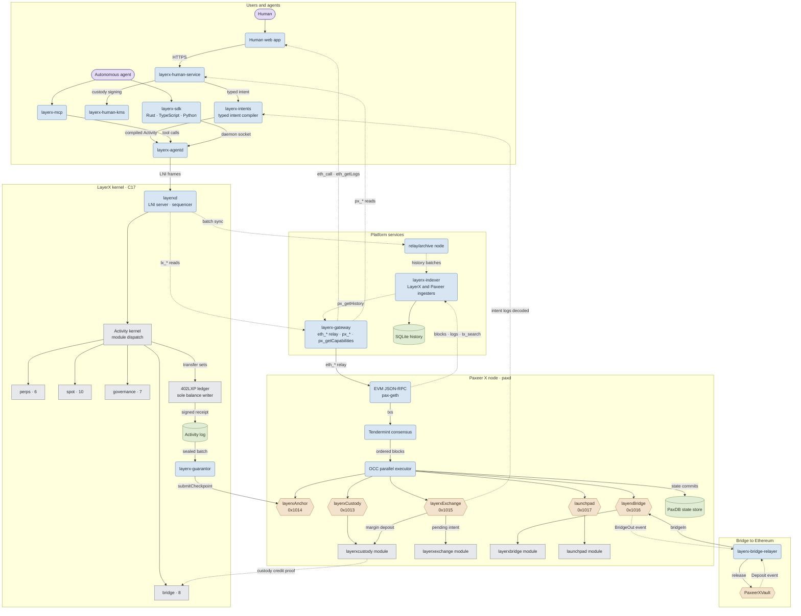
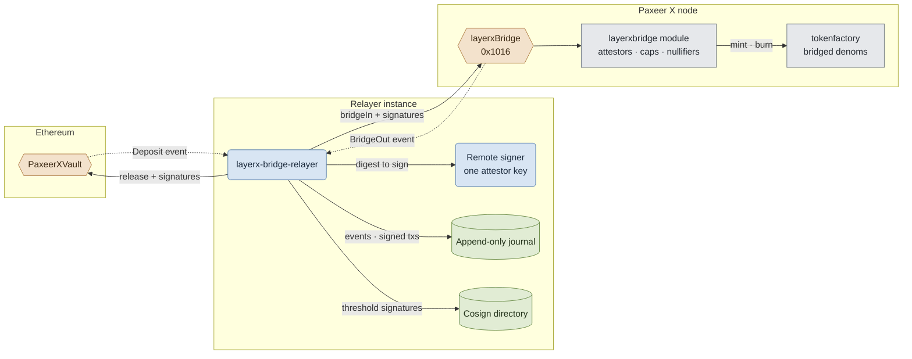

<p align="center"></p>

<h1 align="center">Paxeer X Network</h1>

<h1 align="center">
  
English · [Español](docs/readme/README.es.md) · [日本語](docs/readme/README.ja.md) · [Русский](docs/readme/README.ru.md) · [简体中文](docs/readme/README.zh-CN.md) · [Português](docs/readme/README.pt-BR.md) · [Deutsch](docs/readme/README.de.md) · [Français](docs/readme/README.fr.md)
  
</h1>
<p align="center">
  <!-- ═══ Network Identity ═══ -->
  
  
  
  
  
</p>

<p align="center">
  <!-- ═══ Language Stack ═══ -->
  
  
  
  
  
</p>

<p align="center">
  <!-- ═══ Repo Health ═══ -->
  
  
  
  
</p>

## What Paxeer X Network is
Paxeer X Network is one network with two execution domains: the Paxeer X chain (`paxd`, Go, EVM chain ID 125) and the LayerX kernel (`layerxd`, C17), the deterministic execution and accounting domain for autonomous agents. Official site: [paxeer.network](https://paxeer.network/). Documentation: [docs.paxeer.app](https://docs.paxeer.app/).

Inside the LayerX kernel, every state-changing operation enters as a signed, canonically encoded `Activity`. The kernel verifies the actor and its authority, consumes the account sequence, orders the activity on one global sequence, applies a deterministic state transition, and returns a signed receipt tied to the resulting state root.

The append-only activity log is the authority. Database indexes are disposable projections and can be rebuilt by replaying that log. Consensus-critical execution excludes floating point, local clock decisions, database iteration order, and other sources of nondeterminism. `402LXP` is the only component allowed to write balances. Protocol modules emit validated transfer sets rather than mutating funds themselves.

Ordinary agent activity is executed and ordered inside the LayerX kernel. Periodic checkpoints settle to the Paxeer X chain, which holds custody, checkpoint registration, guarantor bonds, challenges, withdrawals, disputes, and emergency exits. An ordinary kernel action does not require a Paxeer X chain transaction.

This repository is the Sidiora Labs monorepo for Paxeer X Network: the Paxeer X chain and the LayerX kernel in one repository. Co-location keeps the kernel, the chain, contracts, and developer surfaces auditable in one place. Each subsystem keeps its own build, release, deployment, and trust boundary. The governing specification is [`spec/paxeer-x/spec.kvx`](spec/paxeer-x/spec.kvx), rendered as [`spec/paxeer-x/design.md`](spec/paxeer-x/design.md); release notes are in [`CHANGELOG.md`](CHANGELOG.md).

## Try the network

The limited beta has not opened yet. The gateway API becomes available when it does. This is a mainnet beta on real value, so there is no faucet for general use; approved developers receive test allocations from the team.

The public EVM JSON-RPC names for chain ID 125 are listed in
[`docs/site/docs/reference/public-rpc.md`](docs/site/docs/reference/public-rpc.md).
The public endpoint checklist is
[`docs/wiki/Getting-Started-Beta.md`](docs/wiki/Getting-Started-Beta.md).
The wallet, custody-credit funding, Asset, Programs, and HTTP 402 path is
[`docs/wiki/PaymentsQuickstart.md`](docs/wiki/PaymentsQuickstart.md). The
`layerx wallet` and `layerx token` commands are in `platform/cli`, and the
LXT-20 program token interface is in
`programs/crates/layerx-programs-registry/src/lxt20.rs`. Encodings:
[`docs/wiki/Assets.md`](docs/wiki/Assets.md). RPC methods:
[`docs/wiki/PublicRpc.md`](docs/wiki/PublicRpc.md). Evidence levels:
[`docs/wiki/CommitmentLevels.md`](docs/wiki/CommitmentLevels.md). The public
payment API is [`docs/wiki/PublicAPI.md`](docs/wiki/PublicAPI.md).

To run everything locally, follow [`docs/wiki/Quickstart.md`](docs/wiki/Quickstart.md): install the `layerx` CLI from `platform/cli`, bring up a disposable beta cluster with `make platform-beta-cluster-up`, source `build/beta-cluster/env`, then create a key, claim from that cluster's private-network faucet, submit a payment, verify the receipt, and deploy a program.

```sh
layerx key create quickstart
```

```sh
layerx --json payment test \
  --from "$LAYERX_TEST_SOURCE_DID" \
  --to "$LAYERX_TEST_DESTINATION_DID" \
  --currency "$LAYERX_TEST_ASSET" \
  --amount "$LAYERX_TEST_AMOUNT" \
  --idempotency-key paymentquickstart1
```

```sh
layerx --json receipt verify \
  --receipt receipt.hex \
  --batch-id "$batch_id" \
  --asset "$asset" \
  --previous-state-root "$previous_root" \
  --resulting-state-root "$resulting_root" \
  --sequencer-public-key "$sequencer_key"
```

```sh
layerx --json program deploy \
  quickstart-program/target/wasm32-unknown-unknown/release/quickstart_program.wasm \
  --program-id <program_id> \
  --idempotency-key <idempotency_key> \
  --key quickstart \
  --account-sequence 0 \
  --not-before-ms <not_before_ms> \
  --expires-at-ms <expires_at_ms> \
  --previous-state-root <previous_state_root>
```

## Build from source

The core runtime is C17 (`-std=c17` in the root `Makefile`). Agent, human, and platform workspaces use Rust 1.91.1 (`rust-toolchain.toml`). The kernel settlement contracts in `contracts/` use Solidity 0.8.27 (`foundry.toml`). Replay qualification needs GCC 13, Clang 18, Docker, an amd64 musl runner, and an AArch64 cross-compiler plus QEMU; see [`docs/QUALIFICATION.md`](docs/QUALIFICATION.md).

```sh
make build
make test
make test-contracts
make ci
```

Paxeer X chain targets (`paxd`, defined in `chain.mk`), without changing directories:

```sh
make paxeer-build
make paxeer-lint
make paxeer-test
make paxeer-ci
```

`make ci` runs `public-audit`, kernel tests, a two-build archive comparison, consensus symbol checks, and sanitizer suites. `make monorepo-ci` is a separate cross-subsystem gate. A local pass is not authorization to deploy contracts, move custody, or handle real assets.

## Repository layout

| Path | Purpose |
| --- | --- |
| `src/`, `include/` | C17 LayerX kernel runtime, state machine, storage, sequencing, replay, and settlement integration |
| `cmd/` | Kernel daemons and tools (`layerxd`, `layerxctl`, `layerx-guarantor`, genesis, verify) |
| `agent/` | Rust agent interface, SDK, daemon, MCP server, encoding, cryptography, and proof verification |
| `human/` | Human control plane, typed intent compiler, KMS, explorer index, and the web and wallet applications |
| `platform/` | Developer platform, hosted services, middleware, SDKs, emulator, CLI, and release tooling |
| `programs/` | Programs runtime, registry, interpreter, sandbox, market, and program SDKs for the LayerX kernel |
| `interop/` | Agent-commerce and cross-network interoperability surfaces, including the bridge relayer |
| `contracts/` | Solidity contracts on the Paxeer X chain for custody, checkpoints, guarantor bonding, claims, disputes, and exits |
| `bridge/` | Bridge vault contracts and deployment runbook for EVM chains and Solana |
| `explorer/` | Block explorer, a Blockscout fork kept apart from the rest of the monorepo |
| `go.mod`, `chain.mk`, `daemon/`, `node/`, `modules/`, `consensus/`, `sdk/`, `rpc/`, `precompiles/`, `storage/`, `wasm/`, `docker/` | Paxeer X chain node (`paxd`), EVM/RPC compatibility, storage engines, modules, precompiles, and subsystem-local builds |
| `spec/` | Normative KVX specification, generated design, requirements, and task graph |
| `tests/`, `fuzz/` | Native, contract, replay, invariant, fault, and fuzz suites |
| `migrations/` | SQL for kernel genesis import sections, rebuildable projections, and the history index |
| `docs/` | Wiki, documentation site sources, monorepo notes, and qualification documentation |

## Documentation

- Hosted documentation: [docs.paxeer.app](https://docs.paxeer.app/)
- Wiki index: [`docs/wiki/Home.md`](docs/wiki/Home.md)
- Getting started: [`docs/wiki/Getting-Started-Beta.md`](docs/wiki/Getting-Started-Beta.md)
- Payments developer path: [`docs/wiki/PaymentsQuickstart.md`](docs/wiki/PaymentsQuickstart.md)
- Public JSON-RPC: [`docs/wiki/PublicRpc.md`](docs/wiki/PublicRpc.md)
- Assets and tokens: [`docs/wiki/Assets.md`](docs/wiki/Assets.md)
- Commitment levels: [`docs/wiki/CommitmentLevels.md`](docs/wiki/CommitmentLevels.md)
- Monorepo layout and release tags: [`docs/MONOREPO.md`](docs/MONOREPO.md)
- Qualification gates: [`docs/QUALIFICATION.md`](docs/QUALIFICATION.md)
- Specification: [`spec/paxeer-x/spec.kvx`](spec/paxeer-x/spec.kvx)
- Release notes: [`CHANGELOG.md`](CHANGELOG.md)

## SDKs and integrations

| Language | Path |
| --- | --- |
| Rust | `agent/crates/layerx-sdk` |
| Python | `agent/sdk/python` |
| TypeScript | `agent/sdk/typescript` |
| Go | `platform/sdk/go` |
| JVM | `platform/sdk/jvm` |
| .NET | `platform/sdk/dotnet` |
| Swift | `platform/sdk/swift` |

`layerx-agentd` is `agent/crates/layerx-agentd`. The MCP server is `agent/crates/layerx-mcp`. The developer CLI in `platform/cli` installs those transports with `layerx install mcp` and `layerx install a2a`.

## Architecture

Paxeer X Network is one network with two execution domains: the Paxeer X chain node (`paxd`, Go) and the LayerX kernel (`layerxd`, C17), joined by EVM precompiles on one side and hosted platform services on the other. Rounded boxes are running services, cylinders are durable stores, hexagons are contracts and EVM precompiles (labelled with their address), and plain boxes are modules inside a state machine. Arrows follow the direction data moves: solid arrows submit or write, dotted arrows carry reads, events and proofs.



The bridge to Ethereum in detail: each relayer instance holds one attestor key behind a remote signer, journals every observed event and signed transaction before broadcast, and meets a signature threshold above one by exchanging signatures with other instances.



## Contributing

Read [`CONTRIBUTING.md`](CONTRIBUTING.md) before opening a pull request. Protocol changes start in `spec/`. Do not disclose a suspected vulnerability in a public issue; follow [`SECURITY.md`](SECURITY.md).

## Security

Report vulnerabilities through GitHub private reporting, as described in [`SECURITY.md`](SECURITY.md).

## License

Licensed under the Apache License, Version 2.0. See [`LICENSE`](LICENSE) and [`NOTICE`](NOTICE).

Paxeer X Network is developed by Sidiora Labs. Source: [github.com/Sidiora-Labs/Paxeer-X-Network](https://github.com/Sidiora-Labs/Paxeer-X-Network).
