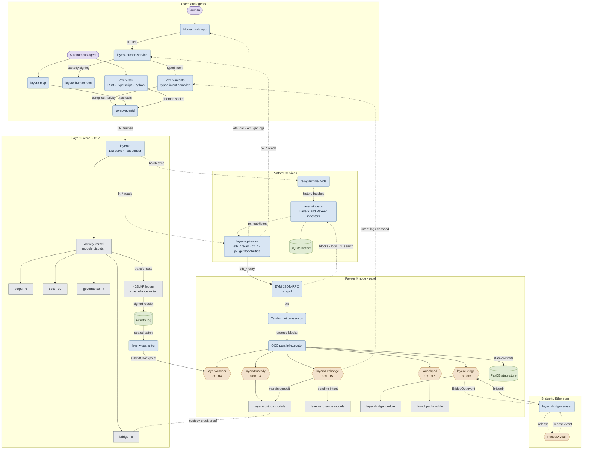
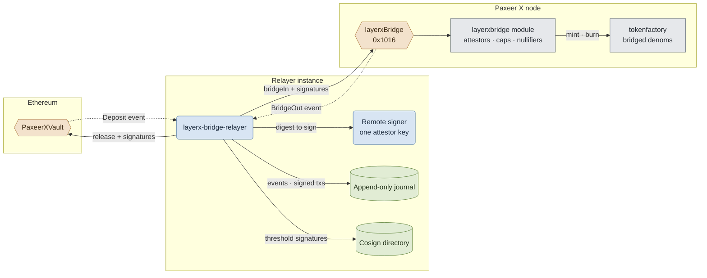

<p align="center"></p>

<h1 align="center">Paxeer X Network</h1>

[English](../../README.md) · [Español](README.es.md) · [日本語](README.ja.md) · [Русский](README.ru.md) · [简体中文](README.zh-CN.md) · [Português](README.pt-BR.md) · Deutsch · [Français](README.fr.md)

*Weicht diese Fassung von der englischen README ab, gilt die englische Fassung.*

<p align="center">
  <!-- ═══ Network Identity ═══ -->
  
  
  
  
  
</p>

<p align="center">
  <!-- ═══ Language Stack ═══ -->
  
  
  
  
  
</p>

<p align="center">
  <!-- ═══ Repo Health ═══ -->
  
  
  
  
</p>

## Was Paxeer X Network ist

Paxeer X Network ist ein Netzwerk mit zwei Ausführungsdomänen: der Paxeer-X-Chain (`paxd`, Go, EVM-Chain-ID 125) und dem LayerX-Kernel (`layerxd`, C17), der deterministischen Ausführungs- und Buchungsdomäne für autonome Agenten. Offizielle Website: [paxeer.network](https://paxeer.network/). Dokumentation: [docs.paxeer.app](https://docs.paxeer.app/).

Im LayerX-Kernel geht jede zustandsändernde Operation als signierte, kanonisch kodierte `Activity` ein. Der Kernel prüft den Akteur und seine Berechtigung, verbraucht die Kontosequenz, ordnet die Activity in eine globale Sequenz ein, wendet einen deterministischen Zustandsübergang an und gibt eine signierte Quittung zurück, die an die resultierende State Root gebunden ist.

Das nur anfügende Aktivitätsprotokoll ist die maßgebliche Quelle. Datenbankindizes sind verwerfbare Projektionen und lassen sich durch erneutes Abspielen dieses Protokolls wieder aufbauen. Konsenskritische Ausführung schließt Gleitkommaarithmetik, Entscheidungen nach der lokalen Uhr, die Iterationsreihenfolge von Datenbanken und andere Quellen von Nichtdeterminismus aus. `402LXP` ist die einzige Komponente, die Salden schreiben darf. Protokollmodule geben validierte Transfersätze aus, statt Guthaben selbst zu verändern.

Gewöhnliche Agentenaktivität wird im LayerX-Kernel ausgeführt und geordnet. Periodische Checkpoints werden auf der Paxeer-X-Chain abgewickelt, die Verwahrung, Checkpoint-Registrierung, Garantenbonds, Challenges, Auszahlungen, Streitfälle und Notausstiege hält. Eine gewöhnliche Kernel-Aktion erfordert keine Transaktion auf der Paxeer-X-Chain.

Dieses Repository ist das Monorepo von Sidiora Labs für Paxeer X Network: die Paxeer-X-Chain und der LayerX-Kernel in einem Repository. Die gemeinsame Ablage hält Kernel, Chain, Contracts und Entwickleroberflächen an einem Ort prüfbar. Jedes Subsystem behält seine eigene Build-, Release-, Deployment- und Vertrauensgrenze. Die maßgebliche Spezifikation ist [`spec/paxeer-x/spec.kvx`](../../spec/paxeer-x/spec.kvx), gerendert als [`spec/paxeer-x/design.md`](../../spec/paxeer-x/design.md); Release Notes stehen in [`CHANGELOG.md`](../../CHANGELOG.md).

## Das Netzwerk ausprobieren

Die limitierte Beta ist noch nicht geöffnet. Die Gateway-API wird verfügbar, sobald sie öffnet. Dies ist eine Mainnet-Beta mit echten Werten, daher gibt es keinen Faucet für die allgemeine Nutzung; zugelassene Entwickler erhalten Testzuteilungen vom Team.

Die öffentlichen EVM-JSON-RPC-Namen für Chain-ID 125 stehen in [`docs/site/docs/reference/public-rpc.md`](../../docs/site/docs/reference/public-rpc.md). Die Checkliste für den öffentlichen Endpunkt ist [`docs/wiki/Getting-Started-Beta.md`](../../docs/wiki/Getting-Started-Beta.md). Der Pfad für Wallet, Finanzierung per Custody-Credit, Asset, Programs und HTTP 402 ist [`docs/wiki/PaymentsQuickstart.md`](../../docs/wiki/PaymentsQuickstart.md). Die Befehle `layerx wallet` und `layerx token` liegen in `platform/cli`, das LXT-20-Token-Interface für Programme in `programs/crates/layerx-programs-registry/src/lxt20.rs`. Encodings: [`docs/wiki/Assets.md`](../../docs/wiki/Assets.md). RPC-Methoden: [`docs/wiki/PublicRpc.md`](../../docs/wiki/PublicRpc.md). Nachweisstufen: [`docs/wiki/CommitmentLevels.md`](../../docs/wiki/CommitmentLevels.md). Die öffentliche Payment-API: [`docs/wiki/PublicAPI.md`](../../docs/wiki/PublicAPI.md).

Um alles lokal zu betreiben, folgen Sie [`docs/wiki/Quickstart.md`](../../docs/wiki/Quickstart.md): die `layerx` CLI aus `platform/cli` installieren, mit `make platform-beta-cluster-up` einen verwerfbaren Beta-Cluster starten, `build/beta-cluster/env` sourcen, dann einen Schlüssel anlegen, beim privaten Faucet dieses Clusters beanspruchen, eine Zahlung einreichen, die Quittung prüfen und ein Programm deployen.

```sh
layerx key create quickstart
```

```sh
layerx --json payment test \
  --from "$LAYERX_TEST_SOURCE_DID" \
  --to "$LAYERX_TEST_DESTINATION_DID" \
  --currency "$LAYERX_TEST_ASSET" \
  --amount "$LAYERX_TEST_AMOUNT" \
  --idempotency-key paymentquickstart1
```

```sh
layerx --json receipt verify \
  --receipt receipt.hex \
  --batch-id "$batch_id" \
  --asset "$asset" \
  --previous-state-root "$previous_root" \
  --resulting-state-root "$resulting_root" \
  --sequencer-public-key "$sequencer_key"
```

```sh
layerx --json program deploy \
  quickstart-program/target/wasm32-unknown-unknown/release/quickstart_program.wasm \
  --program-id <program_id> \
  --idempotency-key <idempotency_key> \
  --key quickstart \
  --account-sequence 0 \
  --not-before-ms <not_before_ms> \
  --expires-at-ms <expires_at_ms> \
  --previous-state-root <previous_state_root>
```

## Aus dem Quellcode bauen

Die Kern-Runtime ist C17 (`-std=c17` im Root-`Makefile`). Die Agent-, Human- und Platform-Workspaces verwenden Rust 1.91.1 (`rust-toolchain.toml`). Die Settlement-Contracts des Kernels in `contracts/` verwenden Solidity 0.8.27 (`foundry.toml`). Die Replay-Qualifikation braucht GCC 13, Clang 18, Docker, einen amd64-musl-Runner sowie einen AArch64-Cross-Compiler mit QEMU; siehe [`docs/QUALIFICATION.md`](../../docs/QUALIFICATION.md).

```sh
make build
make test
make test-contracts
make ci
```

Targets der Paxeer-X-Chain (`paxd`, definiert in `chain.mk`), ohne das Verzeichnis zu wechseln:

```sh
make paxeer-build
make paxeer-lint
make paxeer-test
make paxeer-ci
```

`make ci` führt `public-audit`, die Kernel-Tests, einen Vergleich zweier Builds des Archivs, Prüfungen der Konsens-Symbole und Sanitizer-Suiten aus. `make monorepo-ci` ist ein separates subsystemübergreifendes Gate. Ein lokaler Erfolg ist keine Berechtigung, Contracts zu deployen, Verwahrung zu bewegen oder echte Werte zu handhaben.

## Repository-Aufbau

| Pfad | Zweck |
| --- | --- |
| `src/`, `include/` | C17-Runtime des LayerX-Kernels: Zustandsmaschine, Speicher, Sequenzierung, Replay und Settlement-Anbindung |
| `cmd/` | Kernel-Daemons und Werkzeuge (`layerxd`, `layerxctl`, `layerx-guarantor`, Genesis, Verifikation) |
| `agent/` | Rust-Agentenschnittstelle, SDK, Daemon, MCP-Server, Kodierung, Kryptografie und Beweisprüfung |
| `human/` | Human-Steuerungsebene, typisierter Intent-Compiler, KMS, Explorer-Index sowie Web- und Wallet-Anwendungen |
| `platform/` | Entwicklerplattform, gehostete Dienste, Middleware, SDKs, Emulator, CLI und Release-Werkzeuge |
| `programs/` | Programs-Runtime, Registry, Interpreter, Sandbox, Markt und Programm-SDKs für den LayerX-Kernel |
| `interop/` | Oberflächen für Agenten-Commerce und netzübergreifende Interoperabilität, einschließlich des Bridge-Relayers |
| `contracts/` | Solidity-Contracts auf der Paxeer-X-Chain für Verwahrung, Checkpoints, Garantenbonds, Ansprüche, Streitfälle und Ausstiege |
| `bridge/` | Bridge-Vault-Contracts und Deployment-Runbook für EVM-Chains und Solana |
| `explorer/` | Block-Explorer, ein Blockscout-Fork, getrennt vom Rest des Monorepos gehalten |
| `go.mod`, `chain.mk`, `daemon/`, `node/`, `modules/`, `consensus/`, `sdk/`, `rpc/`, `precompiles/`, `storage/`, `wasm/`, `docker/` | Knoten der Paxeer-X-Chain (`paxd`), EVM/RPC-Kompatibilität, Speicher-Engines, Module, Precompiles und subsystemeigene Builds |
| `spec/` | Normative KVX-Spezifikation, generiertes Design, Anforderungen und Aufgabengraph |
| `tests/`, `fuzz/` | Native, Contract-, Replay-, Invarianten-, Fehler- und Fuzz-Suiten |
| `migrations/` | SQL für die Genesis-Importabschnitte des Kernels, wiederaufbaubare Projektionen und den Verlaufsindex |
| `docs/` | Wiki, Quellen der Dokumentationsseite, Monorepo-Notizen und Qualifikationsdokumentation |

## Dokumentation

- Gehostete Dokumentation: [docs.paxeer.app](https://docs.paxeer.app/)
- Wiki-Index: [`docs/wiki/Home.md`](../../docs/wiki/Home.md)
- Erste Schritte: [`docs/wiki/Getting-Started-Beta.md`](../../docs/wiki/Getting-Started-Beta.md)
- Pfad für Payment-Entwickler: [`docs/wiki/PaymentsQuickstart.md`](../../docs/wiki/PaymentsQuickstart.md)
- Öffentliches JSON-RPC: [`docs/wiki/PublicRpc.md`](../../docs/wiki/PublicRpc.md)
- Assets und Tokens: [`docs/wiki/Assets.md`](../../docs/wiki/Assets.md)
- Commitment-Stufen: [`docs/wiki/CommitmentLevels.md`](../../docs/wiki/CommitmentLevels.md)
- Monorepo-Aufbau und Release-Tags: [`docs/MONOREPO.md`](../../docs/MONOREPO.md)
- Qualifikations-Gates: [`docs/QUALIFICATION.md`](../../docs/QUALIFICATION.md)
- Spezifikation: [`spec/paxeer-x/spec.kvx`](../../spec/paxeer-x/spec.kvx)
- Release Notes: [`CHANGELOG.md`](../../CHANGELOG.md)

## SDKs und Integrationen

| Sprache | Pfad |
| --- | --- |
| Rust | `agent/crates/layerx-sdk` |
| Python | `agent/sdk/python` |
| TypeScript | `agent/sdk/typescript` |
| Go | `platform/sdk/go` |
| JVM | `platform/sdk/jvm` |
| .NET | `platform/sdk/dotnet` |
| Swift | `platform/sdk/swift` |

`layerx-agentd` liegt in `agent/crates/layerx-agentd`. Der MCP-Server liegt in `agent/crates/layerx-mcp`. Die Entwickler-CLI in `platform/cli` installiert diese Transporte mit `layerx install mcp` und `layerx install a2a`.

## Architektur

Paxeer X Network ist ein Netzwerk mit zwei Ausführungsdomänen: dem Knoten der Paxeer-X-Chain (`paxd`, Go) und dem LayerX-Kernel (`layerxd`, C17), verbunden auf der einen Seite durch EVM-Precompiles und auf der anderen durch gehostete Plattformdienste. Abgerundete Kästen sind laufende Dienste, Zylinder sind dauerhafte Speicher, Sechsecke sind Contracts und EVM-Precompiles (mit ihrer Adresse beschriftet), und einfache Kästen sind Module innerhalb einer Zustandsmaschine. Pfeile folgen der Richtung, in der Daten fließen: durchgezogene Pfeile reichen ein oder schreiben, gepunktete Pfeile tragen Lesezugriffe, Events und Beweise.



Die Bridge zu Ethereum im Detail: Jede Relayer-Instanz hält einen Attestor-Schlüssel hinter einem Remote-Signer, journalisiert jedes beobachtete Event und jede signierte Transaktion vor dem Senden und erreicht eine Signaturschwelle über eins, indem sie Signaturen mit anderen Instanzen austauscht.



## Mitwirken

Lesen Sie [`CONTRIBUTING.md`](../../CONTRIBUTING.md), bevor Sie einen Pull Request öffnen. Protokolländerungen beginnen in `spec/`. Melden Sie eine vermutete Schwachstelle nicht in einem öffentlichen Issue; folgen Sie [`SECURITY.md`](../../SECURITY.md).

## Sicherheit

Melden Sie Schwachstellen über das private Reporting von GitHub, wie in [`SECURITY.md`](../../SECURITY.md) beschrieben.

## Lizenz

Lizenziert unter der Apache License, Version 2.0. Siehe [`LICENSE`](../../LICENSE) und [`NOTICE`](../../NOTICE).

Paxeer X Network wird von Sidiora Labs entwickelt. Quellcode: [github.com/Sidiora-Labs/Paxeer-X-Network](https://github.com/Sidiora-Labs/Paxeer-X-Network).
