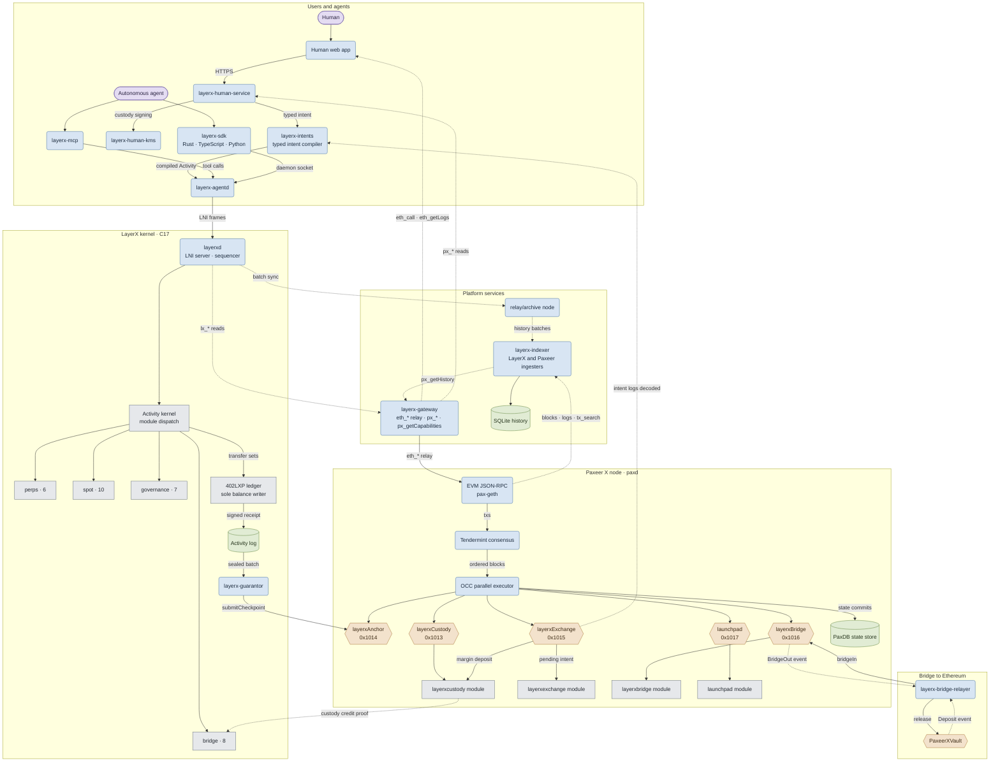
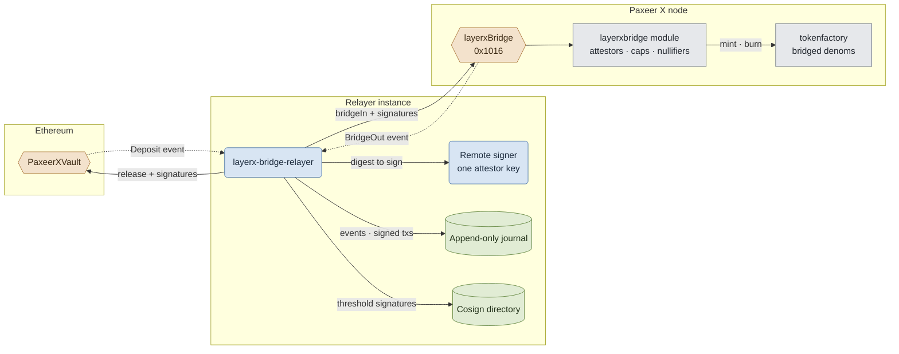

<p align="center"></p>

<h1 align="center">Paxeer X Network</h1>

[English](../../README.md) · Español · [日本語](README.ja.md) · [Русский](README.ru.md) · [简体中文](README.zh-CN.md) · [Português](README.pt-BR.md) · [Deutsch](README.de.md) · [Français](README.fr.md)

*Si esta versión difiere del README en inglés, prevalece la versión en inglés.*

<p align="center">
  <!-- ═══ Network Identity ═══ -->
  
  
  
  
  
</p>

<p align="center">
  <!-- ═══ Language Stack ═══ -->
  
  
  
  
  
</p>

<p align="center">
  <!-- ═══ Repo Health ═══ -->
  
  
  
  
</p>

## Qué es Paxeer X Network

Paxeer X Network es una sola red con dos dominios de ejecución: la cadena Paxeer X (`paxd`, Go, ID de cadena EVM 125) y el kernel LayerX (`layerxd`, C17), el dominio de ejecución y contabilidad determinista para agentes autónomos. Sitio oficial: [paxeer.network](https://paxeer.network/). Documentación: [docs.paxeer.app](https://docs.paxeer.app/).

La cadena Paxeer X ejecuta la EVM sobre consenso Tendermint y contiene los módulos `layerxcustody`, `layerxexchange`, `layerxbridge` y `launchpad`, a los que los contratos acceden mediante los precompilados en `0x1013`, `0x1015`, `0x1016` y `0x1017`. El kernel LayerX ejecuta y contabiliza la actividad de los agentes de forma determinista y devuelve un recibo firmado por cada actividad; sus checkpoints se liquidan en la cadena mediante el precompilado `layerxAnchor` en `0x1014`.

Este repositorio es el monorepo de Sidiora Labs para Paxeer X Network: la cadena Paxeer X y el kernel LayerX en un solo repositorio. Tenerlos juntos mantiene el kernel, la cadena, los contratos y las superficies para desarrolladores auditables en un solo lugar. Cada subsistema conserva su propio límite de compilación, publicación, despliegue y confianza. La especificación que lo rige es [`spec/paxeer-x/spec.kvx`](../../spec/paxeer-x/spec.kvx), renderizada como [`spec/paxeer-x/design.md`](../../spec/paxeer-x/design.md); las notas de versión están en [`CHANGELOG.md`](../../CHANGELOG.md).

## Probar la red

La beta limitada aún no ha abierto. La API del gateway estará disponible cuando abra. Es una beta de mainnet con valor real, así que no hay faucet de uso general; los desarrolladores aprobados reciben asignaciones de prueba del equipo.

Para conectarse a la cadena Paxeer X (ID de cadena 125), use uno de los nombres públicos de JSON-RPC indicados en [`docs/site/docs/reference/public-rpc.md`](../../docs/site/docs/reference/public-rpc.md). La lista de comprobación del endpoint público es [`docs/wiki/Getting-Started-Beta.md`](../../docs/wiki/Getting-Started-Beta.md). El recorrido de billetera, financiación y pagos es [`docs/wiki/PaymentsQuickstart.md`](../../docs/wiki/PaymentsQuickstart.md). Assets: [`docs/wiki/Assets.md`](../../docs/wiki/Assets.md). Métodos RPC: [`docs/wiki/PublicRpc.md`](../../docs/wiki/PublicRpc.md). Niveles de compromiso: [`docs/wiki/CommitmentLevels.md`](../../docs/wiki/CommitmentLevels.md). API pública de pagos: [`docs/wiki/PublicAPI.md`](../../docs/wiki/PublicAPI.md).

Los desarrolladores del kernel empiezan por la documentación alojada en [docs.paxeer.app](https://docs.paxeer.app/); la guía del clúster local es [`docs/wiki/Quickstart.md`](../../docs/wiki/Quickstart.md).

## Compilar desde el código fuente

El nodo de la cadena Paxeer X está escrito en Go 1.25.6 (`go.mod`). El kernel LayerX es C17 (`-std=c17` en el `Makefile` raíz). Los workspaces de agent, human y platform usan Rust 1.91.1 (`rust-toolchain.toml`). Los contratos de liquidación del kernel en `contracts/` usan Solidity 0.8.27 (`foundry.toml`). La calificación de replay necesita GCC 13, Clang 18, Docker, un runner amd64 con musl y un compilador cruzado AArch64 junto con QEMU; consulte [`docs/QUALIFICATION.md`](../../docs/QUALIFICATION.md).

Targets del kernel LayerX:

```sh
make build
make test
make test-contracts
make ci
```

Targets de la cadena Paxeer X (`paxd`, definidos en `chain.mk`), sin cambiar de directorio:

```sh
make paxeer-build
make paxeer-lint
make paxeer-test
make paxeer-ci
```

`make ci` ejecuta `public-audit`, las pruebas del kernel, una comparación del archivo entre dos compilaciones, comprobaciones de símbolos de consenso y suites con sanitizers. `make monorepo-ci` es una puerta separada que abarca varios subsistemas. Pasar en local no autoriza a desplegar contratos, mover custodia ni manejar activos reales.

## Estructura del repositorio

| Ruta | Propósito |
| --- | --- |
| `src/`, `include/` | Runtime C17 del kernel LayerX: máquina de estados, almacenamiento, secuenciación, replay e integración de liquidación |
| `cmd/` | Daemons y herramientas del kernel (`layerxd`, `layerxctl`, `layerx-guarantor`, génesis, verificación) |
| `agent/` | Interfaz de agentes en Rust, SDK, daemon, servidor MCP, codificación, criptografía y verificación de pruebas |
| `human/` | Plano de control humano, compilador de intenciones tipadas, KMS, índice del explorador y las aplicaciones web y de billetera |
| `platform/` | Plataforma para desarrolladores, servicios alojados, middleware, SDKs, emulador, CLI y herramientas de publicación |
| `programs/` | Runtime de Programs, registro, intérprete, sandbox, mercado y SDKs de programas para el kernel LayerX |
| `interop/` | Superficies de comercio entre agentes e interoperabilidad entre redes, incluido el relayer del puente |
| `contracts/` | Contratos Solidity en la cadena Paxeer X para custodia, checkpoints, fianzas de garantes, reclamaciones, disputas y salidas |
| `bridge/` | Contratos de bóveda del puente y guía de despliegue para cadenas EVM y Solana |
| `explorer/` | Explorador de bloques, un fork de Blockscout que se mantiene separado del resto del monorepo |
| `go.mod`, `chain.mk`, `daemon/`, `node/`, `modules/`, `consensus/`, `sdk/`, `rpc/`, `precompiles/`, `storage/`, `wasm/`, `docker/` | Nodo de la cadena Paxeer X (`paxd`), compatibilidad EVM/RPC, motores de almacenamiento, módulos, precompilados y compilaciones propias de cada subsistema |
| `spec/` | Especificación KVX normativa, diseño generado, requisitos y grafo de tareas |
| `tests/`, `fuzz/` | Suites nativas, de contratos, de replay, de invariantes, de fallos y de fuzzing |
| `migrations/` | SQL para las secciones de importación de génesis del kernel, proyecciones reconstruibles y el índice de historial |
| `docs/` | Wiki, fuentes del sitio de documentación, notas del monorepo y documentación de calificación |

## Documentación

- Documentación alojada: [docs.paxeer.app](https://docs.paxeer.app/)
- Índice de la wiki: [`docs/wiki/Home.md`](../../docs/wiki/Home.md)
- Primeros pasos: [`docs/wiki/Getting-Started-Beta.md`](../../docs/wiki/Getting-Started-Beta.md)
- Recorrido para desarrolladores de pagos: [`docs/wiki/PaymentsQuickstart.md`](../../docs/wiki/PaymentsQuickstart.md)
- JSON-RPC público: [`docs/wiki/PublicRpc.md`](../../docs/wiki/PublicRpc.md)
- Assets y tokens: [`docs/wiki/Assets.md`](../../docs/wiki/Assets.md)
- Niveles de compromiso: [`docs/wiki/CommitmentLevels.md`](../../docs/wiki/CommitmentLevels.md)
- Estructura del monorepo y etiquetas de versión: [`docs/MONOREPO.md`](../../docs/MONOREPO.md)
- Puertas de calificación: [`docs/QUALIFICATION.md`](../../docs/QUALIFICATION.md)
- Especificación: [`spec/paxeer-x/spec.kvx`](../../spec/paxeer-x/spec.kvx)
- Notas de versión: [`CHANGELOG.md`](../../CHANGELOG.md)

## SDKs e integraciones

| Lenguaje | Ruta |
| --- | --- |
| Rust | `agent/crates/layerx-sdk` |
| Python | `agent/sdk/python` |
| TypeScript | `agent/sdk/typescript` |
| Go | `platform/sdk/go` |
| JVM | `platform/sdk/jvm` |
| .NET | `platform/sdk/dotnet` |
| Swift | `platform/sdk/swift` |

`layerx-agentd` está en `agent/crates/layerx-agentd`. El servidor MCP está en `agent/crates/layerx-mcp`. La CLI para desarrolladores en `platform/cli` instala esos transportes con `layerx install mcp` y `layerx install a2a`.

## Arquitectura

Paxeer X Network es una sola red con dos dominios de ejecución: el nodo de la cadena Paxeer X (`paxd`, Go) y el kernel LayerX (`layerxd`, C17), unidos por precompilados EVM de un lado y por servicios de plataforma alojados del otro. Los recuadros redondeados son servicios en ejecución, los cilindros son almacenes duraderos, los hexágonos son contratos y precompilados EVM (etiquetados con su dirección) y los recuadros simples son módulos dentro de una máquina de estados. Las flechas siguen la dirección en que se mueven los datos: las continuas envían o escriben, las punteadas llevan lecturas, eventos y pruebas.



El puente hacia Ethereum en detalle: cada instancia del relayer guarda una clave de atestador detrás de un firmante remoto, registra en un diario cada evento observado y cada transacción firmada antes de difundirla, y alcanza un umbral de firmas mayor que uno intercambiando firmas con otras instancias.



## Contribuir

Lea [`CONTRIBUTING.md`](../../CONTRIBUTING.md) antes de abrir un pull request. Los cambios de protocolo empiezan en `spec/`. No divulgue una posible vulnerabilidad en un issue público; siga [`SECURITY.md`](../../SECURITY.md).

## Seguridad

Informe de vulnerabilidades mediante el reporte privado de GitHub, como se describe en [`SECURITY.md`](../../SECURITY.md).

## Licencia

Con licencia Apache License, versión 2.0. Consulte [`LICENSE`](../../LICENSE) y [`NOTICE`](../../NOTICE).

Paxeer X Network está desarrollado por Sidiora Labs. Código fuente: [github.com/Sidiora-Labs/Paxeer-X-Network](https://github.com/Sidiora-Labs/Paxeer-X-Network).
