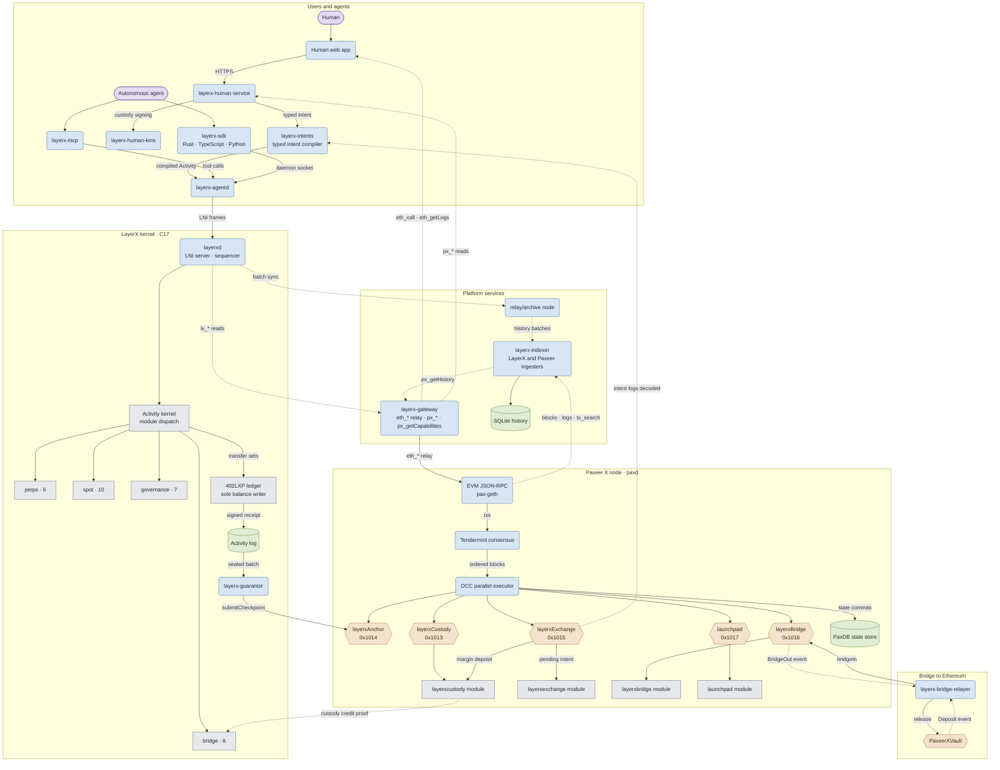
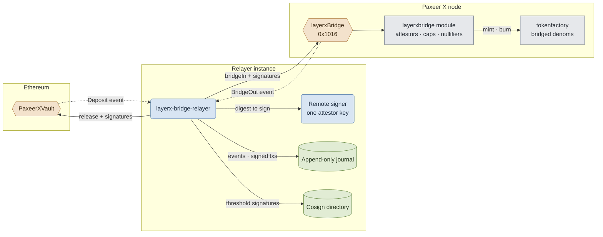

<p align="center"></p>

<h1 align="center">Paxeer X Network</h1>

[English](../../README.md) · [Español](README.es.md) · [日本語](README.ja.md) · [Русский](README.ru.md) · [简体中文](README.zh-CN.md) · [Português](README.pt-BR.md) · [Deutsch](README.de.md) · Français

*Si cette version diffère du README en anglais, la version anglaise fait foi.*

<p align="center">
  <!-- ═══ Network Identity ═══ -->
  
  
  
  
  
</p>

<p align="center">
  <!-- ═══ Language Stack ═══ -->
  
  
  
  
  
</p>

<p align="center">
  <!-- ═══ Repo Health ═══ -->
  
  
  
  
</p>

## Ce qu’est Paxeer X Network

Paxeer X Network est un seul réseau doté de deux domaines d’exécution : la chaîne Paxeer X (`paxd`, Go, identifiant de chaîne EVM 125) et le noyau LayerX (`layerxd`, C17), le domaine d’exécution et de comptabilité déterministe destiné aux agents autonomes. Site officiel : [paxeer.network](https://paxeer.network/). Documentation : [docs.paxeer.app](https://docs.paxeer.app/).

La chaîne Paxeer X assure l’exécution EVM sur un consensus Tendermint et porte les modules `layerxcustody`, `layerxexchange`, `layerxbridge` et `launchpad`, que les contrats atteignent via les précompilés aux adresses `0x1013`, `0x1015`, `0x1016` et `0x1017`. Le noyau LayerX exécute et comptabilise l’activité des agents de manière déterministe et renvoie un reçu signé pour chaque activité ; ses checkpoints sont réglés sur la chaîne via le précompilé `layerxAnchor` à l’adresse `0x1014`.

Ce dépôt est le monorepo de Sidiora Labs pour Paxeer X Network : la chaîne Paxeer X et le noyau LayerX dans un même dépôt. Les réunir permet d’auditer au même endroit le noyau, la chaîne, les contrats et les surfaces pour développeurs. Chaque sous-système garde ses propres limites de compilation, de publication, de déploiement et de confiance. La spécification de référence est [`spec/paxeer-x/spec.kvx`](../../spec/paxeer-x/spec.kvx), rendue sous la forme [`spec/paxeer-x/design.md`](../../spec/paxeer-x/design.md) ; les notes de version se trouvent dans [`CHANGELOG.md`](../../CHANGELOG.md).

## Essayer le réseau

La bêta limitée n’est pas encore ouverte. L’API du gateway sera disponible à son ouverture. Il s’agit d’une bêta mainnet sur de la valeur réelle : il n’y a donc pas de faucet pour un usage général ; les développeurs approuvés reçoivent des allocations de test de la part de l’équipe.

Pour vous connecter à la chaîne Paxeer X (identifiant de chaîne 125), utilisez l’un des noms publics JSON-RPC listés dans [`docs/site/docs/reference/public-rpc.md`](../../docs/site/docs/reference/public-rpc.md). La liste de contrôle du point d’accès public est [`docs/wiki/Getting-Started-Beta.md`](../../docs/wiki/Getting-Started-Beta.md). Le parcours portefeuille, financement et paiements est [`docs/wiki/PaymentsQuickstart.md`](../../docs/wiki/PaymentsQuickstart.md). Assets : [`docs/wiki/Assets.md`](../../docs/wiki/Assets.md). Méthodes RPC : [`docs/wiki/PublicRpc.md`](../../docs/wiki/PublicRpc.md). Niveaux d’engagement : [`docs/wiki/CommitmentLevels.md`](../../docs/wiki/CommitmentLevels.md). API publique de paiement : [`docs/wiki/PublicAPI.md`](../../docs/wiki/PublicAPI.md).

Les développeurs du noyau commencent par la documentation hébergée sur [docs.paxeer.app](https://docs.paxeer.app/) ; le guide du cluster local est [`docs/wiki/Quickstart.md`](../../docs/wiki/Quickstart.md).

## Compiler depuis les sources

Le nœud de la chaîne Paxeer X est écrit en Go 1.25.6 (`go.mod`). Le noyau LayerX est en C17 (`-std=c17` dans le `Makefile` racine). Les workspaces agent, human et platform utilisent Rust 1.91.1 (`rust-toolchain.toml`). Les contrats de règlement du noyau dans `contracts/` utilisent Solidity 0.8.27 (`foundry.toml`). La qualification par rejeu nécessite GCC 13, Clang 18, Docker, un runner amd64 musl ainsi qu’un compilateur croisé AArch64 avec QEMU ; voir [`docs/QUALIFICATION.md`](../../docs/QUALIFICATION.md).

Cibles du noyau LayerX :

```sh
make build
make test
make test-contracts
make ci
```

Cibles de la chaîne Paxeer X (`paxd`, définies dans `chain.mk`), sans changer de répertoire :

```sh
make paxeer-build
make paxeer-lint
make paxeer-test
make paxeer-ci
```

`make ci` exécute `public-audit`, les tests du noyau, une comparaison de l’archive entre deux compilations, des vérifications des symboles de consensus et des suites avec sanitizers. `make monorepo-ci` est une porte distincte couvrant plusieurs sous-systèmes. Un succès en local n’autorise pas à déployer des contrats, à déplacer des actifs en garde ni à manipuler des actifs réels.

## Organisation du dépôt

| Chemin | Rôle |
| --- | --- |
| `src/`, `include/` | Runtime C17 du noyau LayerX : machine à états, stockage, séquencement, rejeu et intégration du règlement |
| `cmd/` | Démons et outils du noyau (`layerxd`, `layerxctl`, `layerx-guarantor`, genèse, vérification) |
| `agent/` | Interface agent en Rust, SDK, démon, serveur MCP, encodage, cryptographie et vérification de preuves |
| `human/` | Plan de contrôle humain, compilateur d’intentions typées, KMS, index de l’explorateur et applications web et portefeuille |
| `platform/` | Plateforme développeur, services hébergés, middleware, SDK, émulateur, CLI et outils de publication |
| `programs/` | Runtime Programs, registre, interpréteur, bac à sable, marché et SDK de programmes pour le noyau LayerX |
| `interop/` | Surfaces de commerce entre agents et d’interopérabilité entre réseaux, y compris le relayer du pont |
| `contracts/` | Contrats Solidity sur la chaîne Paxeer X pour la garde, les checkpoints, les cautions des garants, les réclamations, les litiges et les sorties |
| `bridge/` | Contrats de coffre du pont et guide de déploiement pour les chaînes EVM et Solana |
| `explorer/` | Explorateur de blocs, un fork de Blockscout tenu à l’écart du reste du monorepo |
| `go.mod`, `chain.mk`, `daemon/`, `node/`, `modules/`, `consensus/`, `sdk/`, `rpc/`, `precompiles/`, `storage/`, `wasm/`, `docker/` | Nœud de la chaîne Paxeer X (`paxd`), compatibilité EVM/RPC, moteurs de stockage, modules, précompilés et compilations propres à chaque sous-système |
| `spec/` | Spécification KVX normative, conception générée, exigences et graphe de tâches |
| `tests/`, `fuzz/` | Suites natives, de contrats, de rejeu, d’invariants, de pannes et de fuzzing |
| `migrations/` | SQL pour les sections d’import de genèse du noyau, les projections reconstructibles et l’index d’historique |
| `docs/` | Wiki, sources du site de documentation, notes sur le monorepo et documentation de qualification |

## Documentation

- Documentation hébergée: [docs.paxeer.app](https://docs.paxeer.app/)
- Index du wiki: [`docs/wiki/Home.md`](../../docs/wiki/Home.md)
- Premiers pas: [`docs/wiki/Getting-Started-Beta.md`](../../docs/wiki/Getting-Started-Beta.md)
- Parcours développeur pour les paiements: [`docs/wiki/PaymentsQuickstart.md`](../../docs/wiki/PaymentsQuickstart.md)
- JSON-RPC public: [`docs/wiki/PublicRpc.md`](../../docs/wiki/PublicRpc.md)
- Assets et jetons: [`docs/wiki/Assets.md`](../../docs/wiki/Assets.md)
- Niveaux d’engagement: [`docs/wiki/CommitmentLevels.md`](../../docs/wiki/CommitmentLevels.md)
- Organisation du monorepo et tags de version: [`docs/MONOREPO.md`](../../docs/MONOREPO.md)
- Portes de qualification: [`docs/QUALIFICATION.md`](../../docs/QUALIFICATION.md)
- Spécification: [`spec/paxeer-x/spec.kvx`](../../spec/paxeer-x/spec.kvx)
- Notes de version: [`CHANGELOG.md`](../../CHANGELOG.md)

## SDK et intégrations

| Langage | Chemin |
| --- | --- |
| Rust | `agent/crates/layerx-sdk` |
| Python | `agent/sdk/python` |
| TypeScript | `agent/sdk/typescript` |
| Go | `platform/sdk/go` |
| JVM | `platform/sdk/jvm` |
| .NET | `platform/sdk/dotnet` |
| Swift | `platform/sdk/swift` |

`layerx-agentd` se trouve dans `agent/crates/layerx-agentd`. Le serveur MCP se trouve dans `agent/crates/layerx-mcp`. La CLI développeur de `platform/cli` installe ces transports avec `layerx install mcp` et `layerx install a2a`.

## Architecture

Paxeer X Network est un seul réseau doté de deux domaines d’exécution : le nœud de la chaîne Paxeer X (`paxd`, Go) et le noyau LayerX (`layerxd`, C17), reliés d’un côté par des précompilés EVM et de l’autre par des services de plateforme hébergés. Les boîtes arrondies sont des services en fonctionnement, les cylindres des stockages durables, les hexagones des contrats et précompilés EVM (étiquetés avec leur adresse), et les boîtes simples des modules à l’intérieur d’une machine à états. Les flèches suivent le sens de circulation des données : les flèches pleines soumettent ou écrivent, les flèches pointillées transportent lectures, événements et preuves.



Le pont vers Ethereum en détail : chaque instance du relayer détient une clé d’attestateur derrière un signataire distant, journalise chaque événement observé et chaque transaction signée avant diffusion, et atteint un seuil de signatures supérieur à un en échangeant des signatures avec d’autres instances.



## Contribuer

Lisez [`CONTRIBUTING.md`](../../CONTRIBUTING.md) avant d’ouvrir une pull request. Les changements de protocole commencent dans `spec/`. Ne divulguez pas une vulnérabilité présumée dans une issue publique ; suivez [`SECURITY.md`](../../SECURITY.md).

## Sécurité

Signalez les vulnérabilités via le signalement privé de GitHub, comme décrit dans [`SECURITY.md`](../../SECURITY.md).

## Licence

Distribué sous Apache License, version 2.0. Voir [`LICENSE`](../../LICENSE) et [`NOTICE`](../../NOTICE).

Paxeer X Network est développé par Sidiora Labs. Code source : [github.com/Sidiora-Labs/Paxeer-X-Network](https://github.com/Sidiora-Labs/Paxeer-X-Network).
