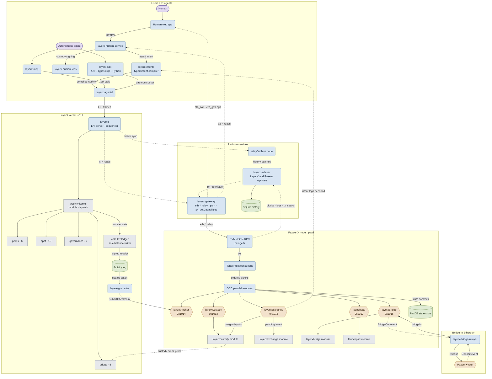
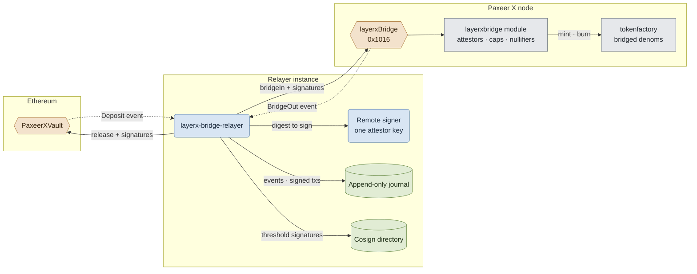

<p align="center"></p>

<h1 align="center">Paxeer X Network</h1>

[English](../../README.md) · [Español](README.es.md) · 日本語 · [Русский](README.ru.md) · [简体中文](README.zh-CN.md) · [Português](README.pt-BR.md) · [Deutsch](README.de.md) · [Français](README.fr.md)

*この版と英語の README の内容が異なる場合は、英語版が優先されます。*

<p align="center">
  <!-- ═══ Network Identity ═══ -->
  
  
  
  
  
</p>

<p align="center">
  <!-- ═══ Language Stack ═══ -->
  
  
  
  
  
</p>

<p align="center">
  <!-- ═══ Repo Health ═══ -->
  
  
  
  
</p>

## Paxeer X Network とは

Paxeer X Network は、二つの実行ドメインを持つ一つのネットワークです。Paxeer X チェーン（`paxd`、Go、EVM チェーン ID 125）と、自律エージェントのための決定的な実行・会計ドメインである LayerX カーネル（`layerxd`、C17）から成ります。公式サイト: [paxeer.network](https://paxeer.network/)。ドキュメント: [docs.paxeer.app](https://docs.paxeer.app/)。

Paxeer X チェーンは Tendermint コンセンサス上で EVM を実行し、`layerxcustody`、`layerxexchange`、`layerxbridge`、`launchpad` の各モジュールを備えています。コントラクトはこれらに `0x1013`、`0x1015`、`0x1016`、`0x1017` のプリコンパイルを通じてアクセスします。LayerX カーネルはエージェントのアクティビティを決定的に実行・会計処理し、アクティビティごとに署名付きレシートを返します。カーネルのチェックポイントは `0x1014` の `layerxAnchor` プリコンパイルを通じてチェーン上で決済されます。

このリポジトリは、Sidiora Labs による Paxeer X Network のモノレポです。Paxeer X チェーンと LayerX カーネルを一つのリポジトリにまとめています。同じ場所に置くことで、カーネル、チェーン、コントラクト、開発者向け機能を一か所で監査できます。各サブシステムは、それぞれ独自のビルド、リリース、デプロイ、信頼の境界を保ちます。基準となる仕様は [`spec/paxeer-x/spec.kvx`](../../spec/paxeer-x/spec.kvx) で、[`spec/paxeer-x/design.md`](../../spec/paxeer-x/design.md) として描画されています。リリースノートは [`CHANGELOG.md`](../../CHANGELOG.md) にあります。

## ネットワークを試す

限定ベータはまだ開始していません。ゲートウェイ API は開始時に利用可能になります。これは実際の価値を扱うメインネットベータのため、一般向けのフォーセットはありません。承認された開発者にはチームからテスト用の割り当てが提供されます。

Paxeer X チェーン（チェーン ID 125）に接続するには、[`docs/site/docs/reference/public-rpc.md`](../../docs/site/docs/reference/public-rpc.md) に掲載されている公開 JSON-RPC 名のいずれかを使ってください。公開エンドポイントのチェックリストは [`docs/wiki/Getting-Started-Beta.md`](../../docs/wiki/Getting-Started-Beta.md) です。ウォレット、入金、決済の手順は [`docs/wiki/PaymentsQuickstart.md`](../../docs/wiki/PaymentsQuickstart.md) です。Asset: [`docs/wiki/Assets.md`](../../docs/wiki/Assets.md)。RPC メソッド: [`docs/wiki/PublicRpc.md`](../../docs/wiki/PublicRpc.md)。コミットメントレベル: [`docs/wiki/CommitmentLevels.md`](../../docs/wiki/CommitmentLevels.md)。公開決済 API: [`docs/wiki/PublicAPI.md`](../../docs/wiki/PublicAPI.md)。

カーネル開発者は [docs.paxeer.app](https://docs.paxeer.app/) のホスト型ドキュメントから始めてください。ローカルクラスタの手順は [`docs/wiki/Quickstart.md`](../../docs/wiki/Quickstart.md) です。

## ソースからビルドする

Paxeer X チェーンのノードは Go 1.25.6 です（`go.mod`）。LayerX カーネルは C17 です（ルートの `Makefile` に `-std=c17`）。agent、human、platform の各ワークスペースは Rust 1.91.1 を使います（`rust-toolchain.toml`）。`contracts/` にあるカーネルの決済コントラクトは Solidity 0.8.27 を使います（`foundry.toml`）。リプレイ検定には GCC 13、Clang 18、Docker、amd64 の musl ランナー、AArch64 クロスコンパイラと QEMU が必要です。詳しくは [`docs/QUALIFICATION.md`](../../docs/QUALIFICATION.md) を参照してください。

LayerX カーネルのターゲット:

```sh
make build
make test
make test-contracts
make ci
```

Paxeer X チェーンのターゲット（`paxd`、`chain.mk` で定義）。ディレクトリを移動せずに実行できます:

```sh
make paxeer-build
make paxeer-lint
make paxeer-test
make paxeer-ci
```

`make ci` は `public-audit`、カーネルのテスト、2 回のビルドによるアーカイブ比較、コンセンサスシンボルのチェック、サニタイザースイートを実行します。`make monorepo-ci` は複数のサブシステムにまたがる別のゲートです。ローカルで通っても、コントラクトのデプロイ、カストディの移動、実資産の取り扱いが許可されるわけではありません。

## リポジトリ構成

| パス | 用途 |
| --- | --- |
| `src/`, `include/` | LayerX カーネルの C17 ランタイム: ステートマシン、ストレージ、シーケンシング、リプレイ、決済連携 |
| `cmd/` | カーネルのデーモンとツール（`layerxd`、`layerxctl`、`layerx-guarantor`、ジェネシス、検証） |
| `agent/` | Rust のエージェントインターフェース、SDK、デーモン、MCP サーバー、エンコーディング、暗号、証明検証 |
| `human/` | 人間向けコントロールプレーン、型付きインテントコンパイラ、KMS、エクスプローラーインデックス、Web アプリとウォレットアプリ |
| `platform/` | 開発者プラットフォーム、ホスト型サービス、ミドルウェア、SDK、エミュレーター、CLI、リリースツール |
| `programs/` | LayerX カーネル向けの Programs ランタイム、レジストリ、インタープリター、サンドボックス、マーケット、プログラム SDK |
| `interop/` | エージェント間コマースとネットワーク間相互運用の機能（ブリッジリレイヤーを含む） |
| `contracts/` | Paxeer X チェーン上の Solidity コントラクト（カストディ、チェックポイント、保証人ボンド、請求、紛争、退出） |
| `bridge/` | EVM チェーンと Solana 向けのブリッジ保管庫コントラクトとデプロイ手順書 |
| `explorer/` | ブロックエクスプローラー。Blockscout のフォークで、モノレポの他の部分とは分離されています |
| `go.mod`, `chain.mk`, `daemon/`, `node/`, `modules/`, `consensus/`, `sdk/`, `rpc/`, `precompiles/`, `storage/`, `wasm/`, `docker/` | Paxeer X チェーンのノード（`paxd`）、EVM/RPC 互換性、ストレージエンジン、モジュール、プリコンパイル、サブシステム固有のビルド |
| `spec/` | 規範となる KVX 仕様、生成された設計、要件、タスクグラフ |
| `tests/`, `fuzz/` | ネイティブ、コントラクト、リプレイ、不変条件、障害、ファズの各テストスイート |
| `migrations/` | カーネルのジェネシスインポートセクション、再構築可能なプロジェクション、履歴インデックスの SQL |
| `docs/` | Wiki、ドキュメントサイトのソース、モノレポのメモ、検定ドキュメント |

## ドキュメント

- ホスト型ドキュメント: [docs.paxeer.app](https://docs.paxeer.app/)
- Wiki 目次: [`docs/wiki/Home.md`](../../docs/wiki/Home.md)
- はじめに: [`docs/wiki/Getting-Started-Beta.md`](../../docs/wiki/Getting-Started-Beta.md)
- 決済開発者向け手順: [`docs/wiki/PaymentsQuickstart.md`](../../docs/wiki/PaymentsQuickstart.md)
- 公開 JSON-RPC: [`docs/wiki/PublicRpc.md`](../../docs/wiki/PublicRpc.md)
- Asset とトークン: [`docs/wiki/Assets.md`](../../docs/wiki/Assets.md)
- コミットメントレベル: [`docs/wiki/CommitmentLevels.md`](../../docs/wiki/CommitmentLevels.md)
- モノレポ構成とリリースタグ: [`docs/MONOREPO.md`](../../docs/MONOREPO.md)
- 検定ゲート: [`docs/QUALIFICATION.md`](../../docs/QUALIFICATION.md)
- 仕様: [`spec/paxeer-x/spec.kvx`](../../spec/paxeer-x/spec.kvx)
- リリースノート: [`CHANGELOG.md`](../../CHANGELOG.md)

## SDK と連携

| 言語 | パス |
| --- | --- |
| Rust | `agent/crates/layerx-sdk` |
| Python | `agent/sdk/python` |
| TypeScript | `agent/sdk/typescript` |
| Go | `platform/sdk/go` |
| JVM | `platform/sdk/jvm` |
| .NET | `platform/sdk/dotnet` |
| Swift | `platform/sdk/swift` |

`layerx-agentd` は `agent/crates/layerx-agentd` にあります。MCP サーバーは `agent/crates/layerx-mcp` にあります。`platform/cli` の開発者 CLI は、`layerx install mcp` と `layerx install a2a` でこれらのトランスポートをインストールします。

## アーキテクチャ

Paxeer X Network は、二つの実行ドメインを持つ一つのネットワークです。Paxeer X チェーンのノード（`paxd`、Go）と LayerX カーネル（`layerxd`、C17）が、一方では EVM プリコンパイルで、もう一方ではホスト型プラットフォームサービスでつながっています。角の丸い箱は稼働中のサービス、円柱は永続ストア、六角形はコントラクトと EVM プリコンパイル（アドレス付き）、普通の箱はステートマシン内のモジュールです。矢印はデータの流れる向きを示し、実線は送信または書き込み、点線は読み取り、イベント、証明を運びます。



Ethereum へのブリッジの詳細: 各リレイヤーインスタンスはリモート署名者の背後に 1 本のアテスター鍵を持ち、観測したすべてのイベントと署名済みトランザクションをブロードキャスト前にジャーナルへ記録し、他のインスタンスと署名を交換することで 1 を超える署名閾値を満たします。



## コントリビュート

プルリクエストを開く前に [`CONTRIBUTING.md`](../../CONTRIBUTING.md) を読んでください。プロトコルの変更は `spec/` から始まります。脆弱性の疑いを公開 issue で開示しないでください。[`SECURITY.md`](../../SECURITY.md) に従ってください。

## セキュリティ

脆弱性は [`SECURITY.md`](../../SECURITY.md) に記載のとおり、GitHub のプライベート報告から報告してください。

## ライセンス

Apache License, Version 2.0 の下でライセンスされています。[`LICENSE`](../../LICENSE) と [`NOTICE`](../../NOTICE) を参照してください。

Paxeer X Network は Sidiora Labs が開発しています。ソース: [github.com/Sidiora-Labs/Paxeer-X-Network](https://github.com/Sidiora-Labs/Paxeer-X-Network)。
