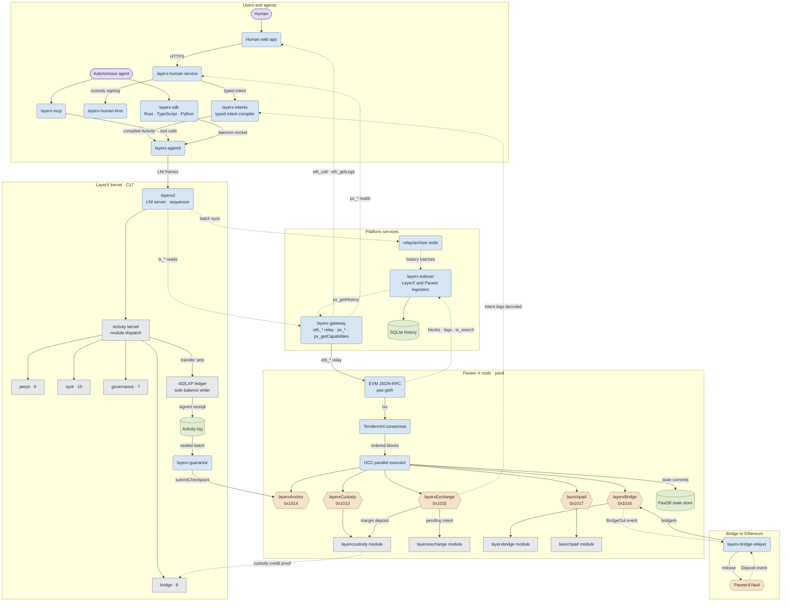
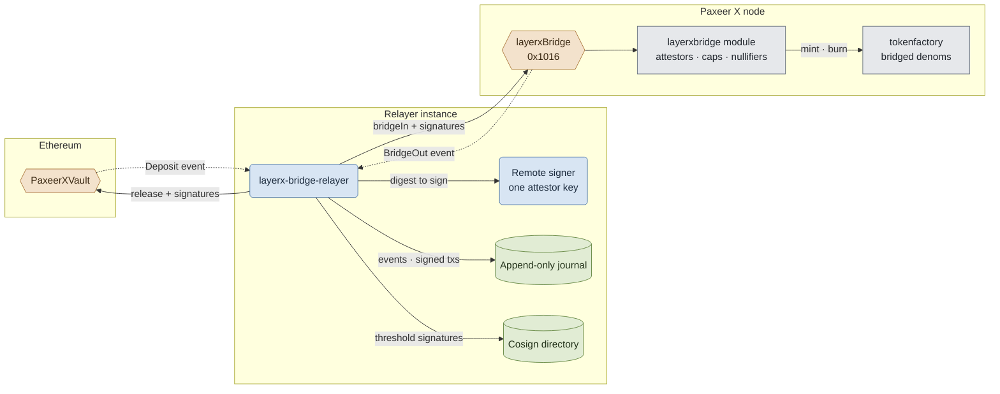

<p align="center"></p>

<h1 align="center">Paxeer X Network</h1>

[English](../../README.md) · [Español](README.es.md) · [日本語](README.ja.md) · [Русский](README.ru.md) · [简体中文](README.zh-CN.md) · Português · [Deutsch](README.de.md) · [Français](README.fr.md)

*Se esta versão divergir do README em inglês, prevalece a versão em inglês.*

<p align="center">
  <!-- ═══ Network Identity ═══ -->
  
  
  
  
  
</p>

<p align="center">
  <!-- ═══ Language Stack ═══ -->
  
  
  
  
  
</p>

<p align="center">
  <!-- ═══ Repo Health ═══ -->
  
  
  
  
</p>

## O que é a Paxeer X Network

A Paxeer X Network é uma única rede com dois domínios de execução: a cadeia Paxeer X (`paxd`, Go, ID de cadeia EVM 125) e o kernel LayerX (`layerxd`, C17), o domínio de execução e contabilidade determinística para agentes autônomos. Site oficial: [paxeer.network](https://paxeer.network/). Documentação: [docs.paxeer.app](https://docs.paxeer.app/).

A cadeia Paxeer X executa a EVM sobre consenso Tendermint e contém os módulos `layerxcustody`, `layerxexchange`, `layerxbridge` e `launchpad`, que os contratos acessam pelos pré-compilados em `0x1013`, `0x1015`, `0x1016` e `0x1017`. O kernel LayerX executa e contabiliza a atividade dos agentes de forma determinística e devolve um recibo assinado para cada atividade; seus checkpoints são liquidados na cadeia pelo pré-compilado `layerxAnchor` em `0x1014`.

Este repositório é o monorepo da Sidiora Labs para a Paxeer X Network: a cadeia Paxeer X e o kernel LayerX em um só repositório. Mantê-los juntos permite auditar o kernel, a cadeia, os contratos e as superfícies para desenvolvedores em um único lugar. Cada subsistema mantém seu próprio limite de build, release, implantação e confiança. A especificação que o rege é [`spec/paxeer-x/spec.kvx`](../../spec/paxeer-x/spec.kvx), renderizada como [`spec/paxeer-x/design.md`](../../spec/paxeer-x/design.md); as notas de versão estão em [`CHANGELOG.md`](../../CHANGELOG.md).

## Experimentar a rede

O beta limitado ainda não foi aberto. A API do gateway fica disponível quando ele abrir. Este é um beta de mainnet com valor real, então não há faucet para uso geral; desenvolvedores aprovados recebem alocações de teste da equipe.

Para se conectar à cadeia Paxeer X (ID de cadeia 125), use um dos nomes públicos de JSON-RPC listados em [`docs/site/docs/reference/public-rpc.md`](../../docs/site/docs/reference/public-rpc.md). A lista de verificação do endpoint público é [`docs/wiki/Getting-Started-Beta.md`](../../docs/wiki/Getting-Started-Beta.md). O caminho de carteira, financiamento e pagamentos é [`docs/wiki/PaymentsQuickstart.md`](../../docs/wiki/PaymentsQuickstart.md). Assets: [`docs/wiki/Assets.md`](../../docs/wiki/Assets.md). Métodos RPC: [`docs/wiki/PublicRpc.md`](../../docs/wiki/PublicRpc.md). Níveis de compromisso: [`docs/wiki/CommitmentLevels.md`](../../docs/wiki/CommitmentLevels.md). API pública de pagamentos: [`docs/wiki/PublicAPI.md`](../../docs/wiki/PublicAPI.md).

Desenvolvedores do kernel começam pela documentação hospedada em [docs.paxeer.app](https://docs.paxeer.app/); o guia do cluster local é [`docs/wiki/Quickstart.md`](../../docs/wiki/Quickstart.md).

## Compilar a partir do código-fonte

O nó da cadeia Paxeer X é escrito em Go 1.25.6 (`go.mod`). O kernel LayerX é C17 (`-std=c17` no `Makefile` raiz). Os workspaces agent, human e platform usam Rust 1.91.1 (`rust-toolchain.toml`). Os contratos de liquidação do kernel em `contracts/` usam Solidity 0.8.27 (`foundry.toml`). A qualificação por replay exige GCC 13, Clang 18, Docker, um runner amd64 com musl e um compilador cruzado AArch64 com QEMU; consulte [`docs/QUALIFICATION.md`](../../docs/QUALIFICATION.md).

Targets do kernel LayerX:

```sh
make build
make test
make test-contracts
make ci
```

Targets da cadeia Paxeer X (`paxd`, definidos em `chain.mk`), sem trocar de diretório:

```sh
make paxeer-build
make paxeer-lint
make paxeer-test
make paxeer-ci
```

`make ci` executa `public-audit`, os testes do kernel, uma comparação do arquivo entre dois builds, verificações de símbolos de consenso e suítes com sanitizers. `make monorepo-ci` é uma verificação separada que abrange vários subsistemas. Passar localmente não autoriza implantar contratos, mover custódia nem lidar com ativos reais.

## Estrutura do repositório

| Caminho | Finalidade |
| --- | --- |
| `src/`, `include/` | Runtime C17 do kernel LayerX: máquina de estados, armazenamento, sequenciamento, replay e integração de liquidação |
| `cmd/` | Daemons e ferramentas do kernel (`layerxd`, `layerxctl`, `layerx-guarantor`, gênese, verificação) |
| `agent/` | Interface de agentes em Rust, SDK, daemon, servidor MCP, codificação, criptografia e verificação de provas |
| `human/` | Plano de controle humano, compilador de intenções tipadas, KMS, índice do explorador e os aplicativos web e de carteira |
| `platform/` | Plataforma para desenvolvedores, serviços hospedados, middleware, SDKs, emulador, CLI e ferramentas de release |
| `programs/` | Runtime de Programs, registro, interpretador, sandbox, mercado e SDKs de programas para o kernel LayerX |
| `interop/` | Superfícies de comércio entre agentes e de interoperabilidade entre redes, incluindo o relayer da ponte |
| `contracts/` | Contratos Solidity na cadeia Paxeer X para custódia, checkpoints, cauções de garantidores, reivindicações, disputas e saídas |
| `bridge/` | Contratos de cofre da ponte e guia de implantação para cadeias EVM e Solana |
| `explorer/` | Explorador de blocos, um fork do Blockscout mantido separado do restante do monorepo |
| `go.mod`, `chain.mk`, `daemon/`, `node/`, `modules/`, `consensus/`, `sdk/`, `rpc/`, `precompiles/`, `storage/`, `wasm/`, `docker/` | Nó da cadeia Paxeer X (`paxd`), compatibilidade EVM/RPC, mecanismos de armazenamento, módulos, pré-compilados e builds próprios de cada subsistema |
| `spec/` | Especificação KVX normativa, design gerado, requisitos e grafo de tarefas |
| `tests/`, `fuzz/` | Suítes nativas, de contratos, de replay, de invariantes, de falhas e de fuzzing |
| `migrations/` | SQL para as seções de importação de gênese do kernel, projeções reconstruíveis e o índice de histórico |
| `docs/` | Wiki, fontes do site de documentação, notas do monorepo e documentação de qualificação |

## Documentação

- Documentação hospedada: [docs.paxeer.app](https://docs.paxeer.app/)
- Índice da wiki: [`docs/wiki/Home.md`](../../docs/wiki/Home.md)
- Primeiros passos: [`docs/wiki/Getting-Started-Beta.md`](../../docs/wiki/Getting-Started-Beta.md)
- Caminho do desenvolvedor de pagamentos: [`docs/wiki/PaymentsQuickstart.md`](../../docs/wiki/PaymentsQuickstart.md)
- JSON-RPC público: [`docs/wiki/PublicRpc.md`](../../docs/wiki/PublicRpc.md)
- Assets e tokens: [`docs/wiki/Assets.md`](../../docs/wiki/Assets.md)
- Níveis de compromisso: [`docs/wiki/CommitmentLevels.md`](../../docs/wiki/CommitmentLevels.md)
- Estrutura do monorepo e tags de release: [`docs/MONOREPO.md`](../../docs/MONOREPO.md)
- Verificações de qualificação: [`docs/QUALIFICATION.md`](../../docs/QUALIFICATION.md)
- Especificação: [`spec/paxeer-x/spec.kvx`](../../spec/paxeer-x/spec.kvx)
- Notas de versão: [`CHANGELOG.md`](../../CHANGELOG.md)

## SDKs e integrações

| Linguagem | Caminho |
| --- | --- |
| Rust | `agent/crates/layerx-sdk` |
| Python | `agent/sdk/python` |
| TypeScript | `agent/sdk/typescript` |
| Go | `platform/sdk/go` |
| JVM | `platform/sdk/jvm` |
| .NET | `platform/sdk/dotnet` |
| Swift | `platform/sdk/swift` |

`layerx-agentd` fica em `agent/crates/layerx-agentd`. O servidor MCP fica em `agent/crates/layerx-mcp`. A CLI para desenvolvedores em `platform/cli` instala esses transportes com `layerx install mcp` e `layerx install a2a`.

## Arquitetura

A Paxeer X Network é uma única rede com dois domínios de execução: o nó da cadeia Paxeer X (`paxd`, Go) e o kernel LayerX (`layerxd`, C17), ligados por pré-compilados EVM de um lado e por serviços de plataforma hospedados do outro. Caixas arredondadas são serviços em execução, cilindros são armazenamentos duráveis, hexágonos são contratos e pré-compilados EVM (rotulados com seu endereço) e caixas simples são módulos dentro de uma máquina de estados. As setas seguem a direção em que os dados se movem: setas sólidas enviam ou escrevem, setas pontilhadas levam leituras, eventos e provas.



A ponte para o Ethereum em detalhe: cada instância do relayer guarda uma chave de atestador atrás de um assinador remoto, registra em diário cada evento observado e cada transação assinada antes da transmissão, e atinge um limiar de assinaturas maior que um trocando assinaturas com outras instâncias.



## Contribuir

Leia [`CONTRIBUTING.md`](../../CONTRIBUTING.md) antes de abrir um pull request. Mudanças de protocolo começam em `spec/`. Não divulgue uma suspeita de vulnerabilidade em uma issue pública; siga [`SECURITY.md`](../../SECURITY.md).

## Segurança

Relate vulnerabilidades pelo relato privado do GitHub, conforme descrito em [`SECURITY.md`](../../SECURITY.md).

## Licença

Licenciado sob a Apache License, versão 2.0. Consulte [`LICENSE`](../../LICENSE) e [`NOTICE`](../../NOTICE).

A Paxeer X Network é desenvolvida pela Sidiora Labs. Código-fonte: [github.com/Sidiora-Labs/Paxeer-X-Network](https://github.com/Sidiora-Labs/Paxeer-X-Network).
