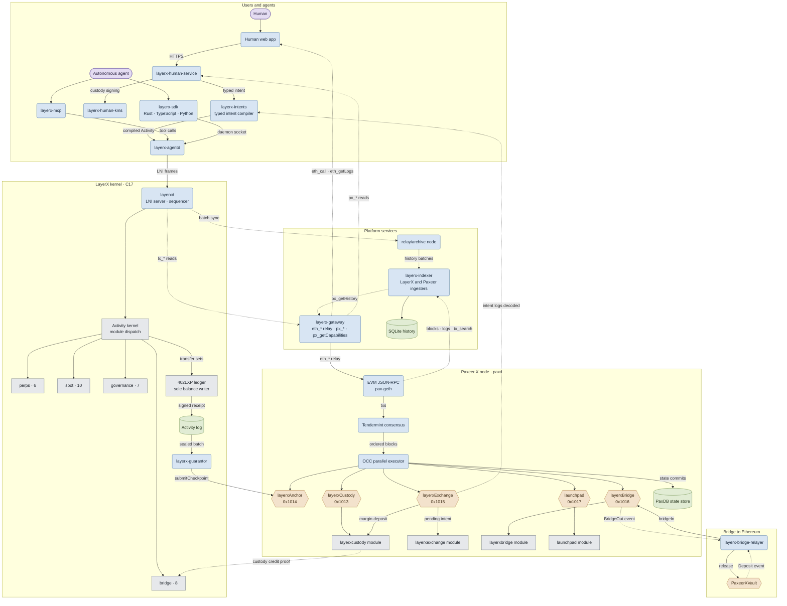
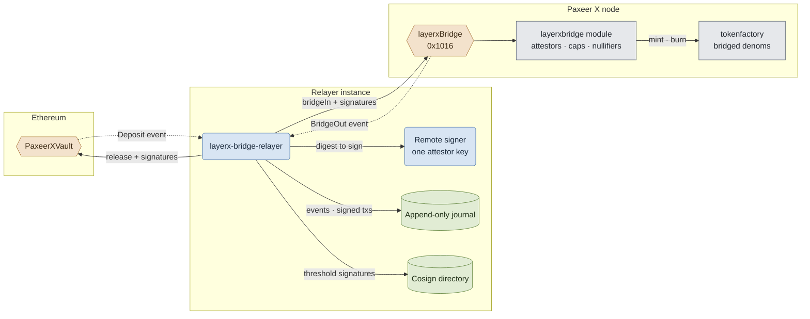

<p align="center"></p>

<h1 align="center">Paxeer X Network</h1>

[English](../../README.md) · [Español](README.es.md) · [日本語](README.ja.md) · Русский · [简体中文](README.zh-CN.md) · [Português](README.pt-BR.md) · [Deutsch](README.de.md) · [Français](README.fr.md)

*Если эта версия расходится с README на английском, верной считается английская версия.*

<p align="center">
  <!-- ═══ Network Identity ═══ -->
  
  
  
  
  
</p>

<p align="center">
  <!-- ═══ Language Stack ═══ -->
  
  
  
  
  
</p>

<p align="center">
  <!-- ═══ Repo Health ═══ -->
  
  
  
  
</p>

## Что такое Paxeer X Network

Paxeer X Network — одна сеть с двумя доменами исполнения: цепочкой Paxeer X (`paxd`, Go, EVM chain ID 125) и ядром LayerX (`layerxd`, C17) — детерминированным доменом исполнения и учёта для автономных агентов. Официальный сайт: [paxeer.network](https://paxeer.network/). Документация: [docs.paxeer.app](https://docs.paxeer.app/).

В ядре LayerX каждая операция, изменяющая состояние, поступает как подписанная, канонически закодированная `Activity`. Ядро проверяет участника и его полномочия, расходует последовательность счёта, упорядочивает активность в единой глобальной последовательности, применяет детерминированный переход состояния и возвращает подписанную квитанцию, привязанную к итоговому корню состояния.

Журнал активностей, допускающий только добавление, является источником истины. Индексы базы данных — одноразовые проекции, их можно перестроить повторным воспроизведением этого журнала. Исполнение, критичное для консенсуса, исключает арифметику с плавающей точкой, решения по локальным часам, порядок обхода базы данных и другие источники недетерминизма. `402LXP` — единственный компонент, которому разрешено записывать балансы. Модули протокола выдают проверенные наборы переводов, а не изменяют средства сами.

Обычная активность агентов исполняется и упорядочивается внутри ядра LayerX. Периодические контрольные точки проводятся в цепочке Paxeer X, которая держит хранение средств, регистрацию контрольных точек, залоги гарантов, оспаривания, выводы, споры и экстренные выходы. Обычное действие в ядре не требует транзакции в цепочке Paxeer X.

Этот репозиторий — монорепозиторий Sidiora Labs для Paxeer X Network: цепочка Paxeer X и ядро LayerX в одном репозитории. Совместное размещение позволяет проверять ядро, цепочку, контракты и инструменты для разработчиков в одном месте. Каждая подсистема сохраняет собственные границы сборки, выпуска, развёртывания и доверия. Определяющая спецификация — [`spec/paxeer-x/spec.kvx`](../../spec/paxeer-x/spec.kvx), её отрисованная версия — [`spec/paxeer-x/design.md`](../../spec/paxeer-x/design.md); заметки о выпусках — в [`CHANGELOG.md`](../../CHANGELOG.md).

## Попробовать сеть

Ограниченная бета ещё не открыта. API шлюза станет доступен, когда она откроется. Это бета основной сети с реальной стоимостью, поэтому крана для общего пользования нет; одобренные разработчики получают тестовые средства от команды.

Публичные имена EVM JSON-RPC для chain ID 125 перечислены в [`docs/site/docs/reference/public-rpc.md`](../../docs/site/docs/reference/public-rpc.md). Контрольный список для публичной точки доступа — [`docs/wiki/Getting-Started-Beta.md`](../../docs/wiki/Getting-Started-Beta.md). Путь для кошелька, пополнения через custody credit, Asset, Programs и HTTP 402 — [`docs/wiki/PaymentsQuickstart.md`](../../docs/wiki/PaymentsQuickstart.md). Команды `layerx wallet` и `layerx token` находятся в `platform/cli`, а интерфейс токена LXT-20 для программ — в `programs/crates/layerx-programs-registry/src/lxt20.rs`. Кодировки: [`docs/wiki/Assets.md`](../../docs/wiki/Assets.md). Методы RPC: [`docs/wiki/PublicRpc.md`](../../docs/wiki/PublicRpc.md). Уровни доказательств: [`docs/wiki/CommitmentLevels.md`](../../docs/wiki/CommitmentLevels.md). Публичный платёжный API: [`docs/wiki/PublicAPI.md`](../../docs/wiki/PublicAPI.md).

Чтобы запустить всё локально, следуйте [`docs/wiki/Quickstart.md`](../../docs/wiki/Quickstart.md): установите CLI `layerx` из `platform/cli`, поднимите одноразовый бета-кластер командой `make platform-beta-cluster-up`, подключите `build/beta-cluster/env`, затем создайте ключ, получите средства из приватного крана этого кластера, отправьте платёж, проверьте квитанцию и разверните программу.

```sh
layerx key create quickstart
```

```sh
layerx --json payment test \
  --from "$LAYERX_TEST_SOURCE_DID" \
  --to "$LAYERX_TEST_DESTINATION_DID" \
  --currency "$LAYERX_TEST_ASSET" \
  --amount "$LAYERX_TEST_AMOUNT" \
  --idempotency-key paymentquickstart1
```

```sh
layerx --json receipt verify \
  --receipt receipt.hex \
  --batch-id "$batch_id" \
  --asset "$asset" \
  --previous-state-root "$previous_root" \
  --resulting-state-root "$resulting_root" \
  --sequencer-public-key "$sequencer_key"
```

```sh
layerx --json program deploy \
  quickstart-program/target/wasm32-unknown-unknown/release/quickstart_program.wasm \
  --program-id <program_id> \
  --idempotency-key <idempotency_key> \
  --key quickstart \
  --account-sequence 0 \
  --not-before-ms <not_before_ms> \
  --expires-at-ms <expires_at_ms> \
  --previous-state-root <previous_state_root>
```

## Сборка из исходного кода

Основная среда исполнения написана на C17 (`-std=c17` в корневом `Makefile`). Рабочие пространства agent, human и platform используют Rust 1.91.1 (`rust-toolchain.toml`). Расчётные контракты ядра в `contracts/` используют Solidity 0.8.27 (`foundry.toml`). Для квалификации воспроизведением нужны GCC 13, Clang 18, Docker, раннер amd64 с musl, а также кросс-компилятор AArch64 и QEMU; см. [`docs/QUALIFICATION.md`](../../docs/QUALIFICATION.md).

```sh
make build
make test
make test-contracts
make ci
```

Цели цепочки Paxeer X (`paxd`, определены в `chain.mk`), без смены каталога:

```sh
make paxeer-build
make paxeer-lint
make paxeer-test
make paxeer-ci
```

`make ci` запускает `public-audit`, тесты ядра, сравнение архива из двух сборок, проверки символов консенсуса и наборы тестов с санитайзерами. `make monorepo-ci` — отдельная проверка, охватывающая несколько подсистем. Успешный локальный прогон не даёт права развёртывать контракты, перемещать средства на хранении или работать с реальными активами.

## Структура репозитория

| Путь | Назначение |
| --- | --- |
| `src/`, `include/` | Среда исполнения ядра LayerX на C17: машина состояний, хранилище, упорядочивание, воспроизведение и интеграция расчётов |
| `cmd/` | Демоны и инструменты ядра (`layerxd`, `layerxctl`, `layerx-guarantor`, генезис, проверка) |
| `agent/` | Интерфейс агентов на Rust, SDK, демон, MCP-сервер, кодирование, криптография и проверка доказательств |
| `human/` | Плоскость управления для людей, компилятор типизированных намерений, KMS, индекс обозревателя, а также веб-приложение и кошелёк |
| `platform/` | Платформа для разработчиков, размещённые сервисы, промежуточное ПО, SDK, эмулятор, CLI и инструменты выпуска |
| `programs/` | Среда исполнения Programs, реестр, интерпретатор, песочница, рынок и SDK программ для ядра LayerX |
| `interop/` | Интерфейсы коммерции между агентами и межсетевого взаимодействия, включая релейер моста |
| `contracts/` | Контракты Solidity в цепочке Paxeer X для хранения, контрольных точек, залогов гарантов, требований, споров и выходов |
| `bridge/` | Контракты хранилища моста и руководство по развёртыванию для EVM-цепочек и Solana |
| `explorer/` | Обозреватель блоков, форк Blockscout, который держится отдельно от остального монорепозитория |
| `go.mod`, `chain.mk`, `daemon/`, `node/`, `modules/`, `consensus/`, `sdk/`, `rpc/`, `precompiles/`, `storage/`, `wasm/`, `docker/` | Узел цепочки Paxeer X (`paxd`), совместимость EVM/RPC, движки хранения, модули, прекомпиляты и собственные сборки подсистем |
| `spec/` | Нормативная спецификация KVX, сгенерированный дизайн, требования и граф задач |
| `tests/`, `fuzz/` | Нативные, контрактные, воспроизводящие, инвариантные, отказные и фаззинг-наборы тестов |
| `migrations/` | SQL для разделов импорта генезиса ядра, перестраиваемых проекций и индекса истории |
| `docs/` | Вики, исходники сайта документации, заметки о монорепозитории и документация по квалификации |

## Документация

- Размещённая документация: [docs.paxeer.app](https://docs.paxeer.app/)
- Оглавление вики: [`docs/wiki/Home.md`](../../docs/wiki/Home.md)
- Начало работы: [`docs/wiki/Getting-Started-Beta.md`](../../docs/wiki/Getting-Started-Beta.md)
- Путь разработчика платежей: [`docs/wiki/PaymentsQuickstart.md`](../../docs/wiki/PaymentsQuickstart.md)
- Публичный JSON-RPC: [`docs/wiki/PublicRpc.md`](../../docs/wiki/PublicRpc.md)
- Активы и токены: [`docs/wiki/Assets.md`](../../docs/wiki/Assets.md)
- Уровни подтверждения: [`docs/wiki/CommitmentLevels.md`](../../docs/wiki/CommitmentLevels.md)
- Структура монорепозитория и теги выпусков: [`docs/MONOREPO.md`](../../docs/MONOREPO.md)
- Квалификационные проверки: [`docs/QUALIFICATION.md`](../../docs/QUALIFICATION.md)
- Спецификация: [`spec/paxeer-x/spec.kvx`](../../spec/paxeer-x/spec.kvx)
- Заметки о выпусках: [`CHANGELOG.md`](../../CHANGELOG.md)

## SDK и интеграции

| Язык | Путь |
| --- | --- |
| Rust | `agent/crates/layerx-sdk` |
| Python | `agent/sdk/python` |
| TypeScript | `agent/sdk/typescript` |
| Go | `platform/sdk/go` |
| JVM | `platform/sdk/jvm` |
| .NET | `platform/sdk/dotnet` |
| Swift | `platform/sdk/swift` |

`layerx-agentd` находится в `agent/crates/layerx-agentd`. MCP-сервер находится в `agent/crates/layerx-mcp`. CLI для разработчиков из `platform/cli` устанавливает эти транспорты командами `layerx install mcp` и `layerx install a2a`.

## Архитектура

Paxeer X Network — одна сеть с двумя доменами исполнения: узлом цепочки Paxeer X (`paxd`, Go) и ядром LayerX (`layerxd`, C17), которые соединены EVM-прекомпилятами с одной стороны и размещёнными сервисами платформы с другой. Скруглённые блоки — работающие сервисы, цилиндры — долговременные хранилища, шестиугольники — контракты и EVM-прекомпиляты (подписаны своими адресами), простые блоки — модули внутри машины состояний. Стрелки показывают направление движения данных: сплошные отправляют или записывают, пунктирные несут чтения, события и доказательства.



Мост в Ethereum подробнее: каждый экземпляр релейера держит один ключ аттестатора за удалённым подписантом, записывает в журнал каждое наблюдённое событие и каждую подписанную транзакцию до отправки и набирает порог подписей больше единицы, обмениваясь подписями с другими экземплярами.



## Участие в разработке

Прочитайте [`CONTRIBUTING.md`](../../CONTRIBUTING.md) перед открытием pull request. Изменения протокола начинаются в `spec/`. Не раскрывайте предполагаемую уязвимость в публичном issue; следуйте [`SECURITY.md`](../../SECURITY.md).

## Безопасность

Сообщайте об уязвимостях через приватные отчёты GitHub, как описано в [`SECURITY.md`](../../SECURITY.md).

## Лицензия

Распространяется по лицензии Apache License, версия 2.0. См. [`LICENSE`](../../LICENSE) и [`NOTICE`](../../NOTICE).

Paxeer X Network разрабатывает Sidiora Labs. Исходный код: [github.com/Sidiora-Labs/Paxeer-X-Network](https://github.com/Sidiora-Labs/Paxeer-X-Network).
