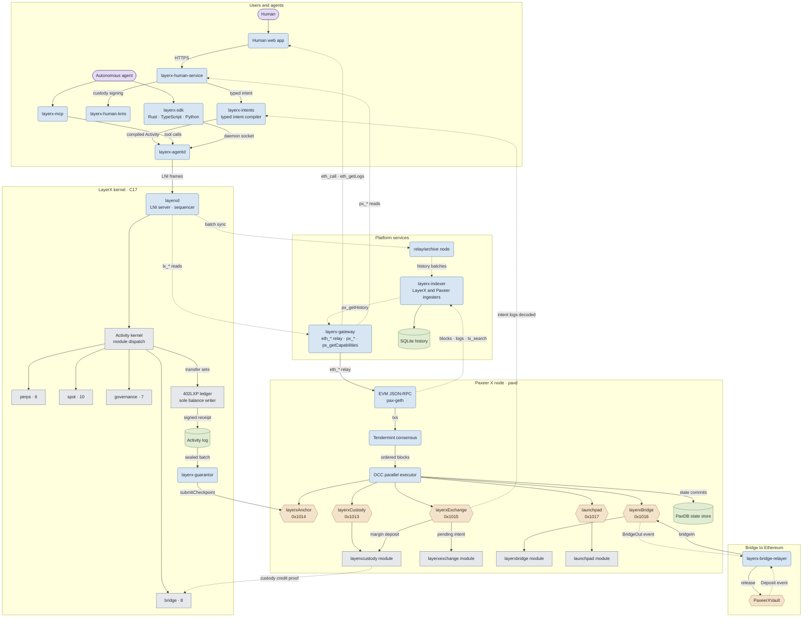
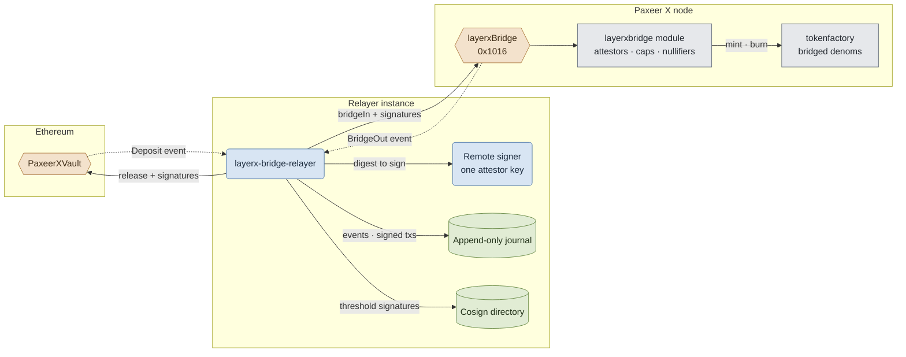

<p align="center"></p>

<h1 align="center">Paxeer X Network</h1>

[English](../../README.md) · [Español](README.es.md) · [日本語](README.ja.md) · [Русский](README.ru.md) · 简体中文 · [Português](README.pt-BR.md) · [Deutsch](README.de.md) · [Français](README.fr.md)

*如本译本与英文 README 不一致，以英文版本为准。*

<p align="center">
  <!-- ═══ Network Identity ═══ -->
  
  
  
  
  
</p>

<p align="center">
  <!-- ═══ Language Stack ═══ -->
  
  
  
  
  
</p>

<p align="center">
  <!-- ═══ Repo Health ═══ -->
  
  
  
  
</p>

## Paxeer X Network 是什么

Paxeer X Network 是一个拥有两个执行域的网络：Paxeer X 链（`paxd`，Go，EVM 链 ID 125）和 LayerX 内核（`layerxd`，C17）。LayerX 内核是面向自主代理的确定性执行与记账域。官方网站：[paxeer.network](https://paxeer.network/)。文档：[docs.paxeer.app](https://docs.paxeer.app/)。

Paxeer X 链在 Tendermint 共识之上运行 EVM 执行，并包含 `layerxcustody`、`layerxexchange`、`layerxbridge` 和 `launchpad` 模块，合约通过位于 `0x1013`、`0x1015`、`0x1016` 和 `0x1017` 的预编译合约访问它们。LayerX 内核以确定性方式执行代理活动并记账，为每个活动返回签名收据；其检查点通过位于 `0x1014` 的 `layerxAnchor` 预编译合约在链上结算。

本仓库是 Sidiora Labs 为 Paxeer X Network 维护的单一仓库：Paxeer X 链和 LayerX 内核位于同一个仓库中。放在一起使内核、链、合约和开发者接口可以在同一处审计。每个子系统保留各自的构建、发布、部署和信任边界。规范性说明是 [`spec/paxeer-x/spec.kvx`](../../spec/paxeer-x/spec.kvx)，渲染版本为 [`spec/paxeer-x/design.md`](../../spec/paxeer-x/design.md)；发布说明见 [`CHANGELOG.md`](../../CHANGELOG.md)。

## 试用网络

有限测试版尚未开放。网关 API 将在开放时可用。这是承载真实价值的主网测试版，因此没有面向公众的水龙头；获批的开发者会从团队获得测试额度。

要连接 Paxeer X 链（链 ID 125），请使用 [`docs/site/docs/reference/public-rpc.md`](../../docs/site/docs/reference/public-rpc.md) 中列出的任一公共 JSON-RPC 名称。公共端点检查清单是 [`docs/wiki/Getting-Started-Beta.md`](../../docs/wiki/Getting-Started-Beta.md)。钱包、注资和支付流程见 [`docs/wiki/PaymentsQuickstart.md`](../../docs/wiki/PaymentsQuickstart.md)。资产：[`docs/wiki/Assets.md`](../../docs/wiki/Assets.md)。RPC 方法：[`docs/wiki/PublicRpc.md`](../../docs/wiki/PublicRpc.md)。承诺级别：[`docs/wiki/CommitmentLevels.md`](../../docs/wiki/CommitmentLevels.md)。公共支付 API：[`docs/wiki/PublicAPI.md`](../../docs/wiki/PublicAPI.md)。

内核开发者请从 [docs.paxeer.app](https://docs.paxeer.app/) 上的托管文档开始；本地集群操作指南见 [`docs/wiki/Quickstart.md`](../../docs/wiki/Quickstart.md)。

## 从源码构建

Paxeer X 链节点使用 Go 1.25.6（`go.mod`）。LayerX 内核使用 C17（根目录 `Makefile` 中的 `-std=c17`）。agent、human 和 platform 工作区使用 Rust 1.91.1（`rust-toolchain.toml`）。`contracts/` 中的内核结算合约使用 Solidity 0.8.27（`foundry.toml`）。重放资格验证需要 GCC 13、Clang 18、Docker、amd64 musl 运行器，以及 AArch64 交叉编译器和 QEMU；参见 [`docs/QUALIFICATION.md`](../../docs/QUALIFICATION.md)。

LayerX 内核目标：

```sh
make build
make test
make test-contracts
make ci
```

Paxeer X 链目标（`paxd`，定义在 `chain.mk` 中），无需切换目录：

```sh
make paxeer-build
make paxeer-lint
make paxeer-test
make paxeer-ci
```

`make ci` 运行 `public-audit`、内核测试、两次构建的归档比对、共识符号检查以及 sanitizer 测试套件。`make monorepo-ci` 是一个独立的跨子系统检查。本地通过并不意味着获得部署合约、转移托管资产或处理真实资产的授权。

## 仓库结构

| 路径 | 用途 |
| --- | --- |
| `src/`, `include/` | LayerX 内核的 C17 运行时：状态机、存储、排序、重放和结算集成 |
| `cmd/` | 内核守护进程和工具（`layerxd`、`layerxctl`、`layerx-guarantor`、创世、验证） |
| `agent/` | Rust 代理接口、SDK、守护进程、MCP 服务器、编码、密码学和证明验证 |
| `human/` | 面向人的控制平面、类型化意图编译器、KMS、浏览器索引以及 Web 和钱包应用 |
| `platform/` | 开发者平台、托管服务、中间件、SDK、模拟器、CLI 和发布工具 |
| `programs/` | 面向 LayerX 内核的 Programs 运行时、注册表、解释器、沙箱、市场和程序 SDK |
| `interop/` | 代理商务与跨网络互操作接口，包括跨链桥中继器 |
| `contracts/` | Paxeer X 链上的 Solidity 合约，用于托管、检查点、担保人保证金、索赔、争议和退出 |
| `bridge/` | 面向 EVM 链和 Solana 的跨链桥金库合约及部署手册 |
| `explorer/` | 区块浏览器，Blockscout 的分支，与单一仓库的其余部分分开维护 |
| `go.mod`, `chain.mk`, `daemon/`, `node/`, `modules/`, `consensus/`, `sdk/`, `rpc/`, `precompiles/`, `storage/`, `wasm/`, `docker/` | Paxeer X 链节点（`paxd`）、EVM/RPC 兼容层、存储引擎、模块、预编译合约和子系统内的构建 |
| `spec/` | 规范性 KVX 规格、生成的设计、需求和任务图 |
| `tests/`, `fuzz/` | 原生、合约、重放、不变量、故障和模糊测试套件 |
| `migrations/` | 用于内核创世导入分段、可重建投影和历史索引的 SQL |
| `docs/` | Wiki、文档站点源文件、单一仓库说明和资格验证文档 |

## 文档

- 托管文档: [docs.paxeer.app](https://docs.paxeer.app/)
- Wiki 索引: [`docs/wiki/Home.md`](../../docs/wiki/Home.md)
- 入门: [`docs/wiki/Getting-Started-Beta.md`](../../docs/wiki/Getting-Started-Beta.md)
- 支付开发者指南: [`docs/wiki/PaymentsQuickstart.md`](../../docs/wiki/PaymentsQuickstart.md)
- 公共 JSON-RPC: [`docs/wiki/PublicRpc.md`](../../docs/wiki/PublicRpc.md)
- 资产与代币: [`docs/wiki/Assets.md`](../../docs/wiki/Assets.md)
- 承诺级别: [`docs/wiki/CommitmentLevels.md`](../../docs/wiki/CommitmentLevels.md)
- 单一仓库结构与发布标签: [`docs/MONOREPO.md`](../../docs/MONOREPO.md)
- 资格验证检查: [`docs/QUALIFICATION.md`](../../docs/QUALIFICATION.md)
- 规格: [`spec/paxeer-x/spec.kvx`](../../spec/paxeer-x/spec.kvx)
- 发布说明: [`CHANGELOG.md`](../../CHANGELOG.md)

## SDK 与集成

| 语言 | 路径 |
| --- | --- |
| Rust | `agent/crates/layerx-sdk` |
| Python | `agent/sdk/python` |
| TypeScript | `agent/sdk/typescript` |
| Go | `platform/sdk/go` |
| JVM | `platform/sdk/jvm` |
| .NET | `platform/sdk/dotnet` |
| Swift | `platform/sdk/swift` |

`layerx-agentd` 位于 `agent/crates/layerx-agentd`。MCP 服务器位于 `agent/crates/layerx-mcp`。`platform/cli` 中的开发者 CLI 通过 `layerx install mcp` 和 `layerx install a2a` 安装这些传输方式。

## 架构

Paxeer X Network 是一个拥有两个执行域的网络：Paxeer X 链节点（`paxd`，Go）和 LayerX 内核（`layerxd`，C17），一侧通过 EVM 预编译合约相连，另一侧通过托管平台服务相连。圆角框是运行中的服务，圆柱是持久存储，六边形是合约和 EVM 预编译合约（标注其地址），普通方框是状态机内的模块。箭头表示数据流动的方向：实线箭头表示提交或写入，虚线箭头承载读取、事件和证明。



通往以太坊的跨链桥细节：每个中继器实例在远程签名器之后持有一把证明者密钥，在广播前将每个观察到的事件和每笔签名交易写入日志，并通过与其他实例交换签名来达到大于一的签名阈值。



## 参与贡献

提交 pull request 前请阅读 [`CONTRIBUTING.md`](../../CONTRIBUTING.md)。协议变更从 `spec/` 开始。请勿在公开 issue 中披露疑似漏洞；请遵循 [`SECURITY.md`](../../SECURITY.md)。

## 安全

请按照 [`SECURITY.md`](../../SECURITY.md) 中的说明，通过 GitHub 私密报告渠道报告漏洞。

## 许可证

采用 Apache License 2.0 许可。参见 [`LICENSE`](../../LICENSE) 和 [`NOTICE`](../../NOTICE)。

Paxeer X Network 由 Sidiora Labs 开发。源码：[github.com/Sidiora-Labs/Paxeer-X-Network](https://github.com/Sidiora-Labs/Paxeer-X-Network)。
