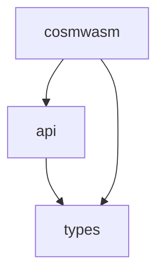

# wasmvm

This is a wrapper around the
[CosmWasm VM](https://github.com/CosmWasm/cosmwasm/tree/main/packages/vm). It
allows you to compile, initialize and execute CosmWasm smart contracts from Go
applications, in particular from [`wasm/x/wasm`](../wasm/x/wasm).

This directory is the Paxeer X Network copy of wasmvm. It is part of the root Go
module, so its import path is `github.com/sidiora-labs/paxeer-network/wasm-runtime`.
The Rust library (`libwasmvm`, crate version 1.5.4) builds against `cosmwasm-vm` from
[Paxeer-Network/pax-cosmwasm](https://github.com/Paxeer-Network/pax-cosmwasm)
(`libwasmvm/Cargo.toml`). Unless noted otherwise, the commands below run from
`wasm-runtime/`.

## Structure

This repo contains both Rust and Go code. The Rust code is compiled into a
library (shared `.dll`/`.dylib`/`.so` or static `.a`) to be linked via cgo and
wrapped with a pleasant Go API. The full build step involves compiling Rust -> C
library, and linking that library to the Go code. For ergonomics of the user, we
will include pre-compiled libraries to easily link with, and Go developers
should just be able to import this directly.

### Rust code

The Rust code lives in a sub-folder `./libwasmvm`. This folder compiles to a
library that can be used via FFI. It is compiled like this:

```sh
# Run unit tests
(cd libwasmvm && cargo test)

# Create release build for your current system. Uses whatever default Rust
# version you have installed.
make build-rust

# Create reproducible release builds for other systems (slow, don't use for development)
make release-build-alpine
make release-build-linux
make release-build-macos
make release-build-windows
```

### Go code

The Go code consists of three packages:

1. The types (the `github.com/sidiora-labs/paxeer-network/wasm-runtime/types` import), using
   `package types`
2. The internal package `internal/api`, using `package api`
3. This directory (the `github.com/sidiora-labs/paxeer-network/wasm-runtime` import), using `package cosmwasm`

The dependencies between them are as follows:



The Go code is built like this:

```
make build-go
make test
```

#### Package github.com/sidiora-labs/paxeer-network/wasm-runtime/types

This packages contains types used by the two other packages. It can be compiled
without cgo.

```sh
# Build
go build ./types
# Build without CGO
CGO_ENABLED=0 go build ./types
```

#### Package internal/api

This package contains the code binding the libwasmvm build to the Go code. All
low level FFI handling code belongs there. This package can only be built using
cgo. Using the `internal/` convention makes this package fully private.

#### Package github.com/sidiora-labs/paxeer-network/wasm-runtime

This is the package users import. It can be compiled without cgo, but when you
do so, a lot of functionality is removed.

```sh
# Build
go build .
# Build without CGO
CGO_ENABLED=0 go build .
```

## Supported Platforms

The Rust implementation of the VM is compiled to a library called libwasmvm.
This is then linked to the Go code when the final binary is built. For that
reason not all systems supported by Go are supported by this project.

Linux (tested on Ubuntu, Debian, and CentOS7, Alpine) and macOS is supported. We
are working on Windows (#288).

[#288]: https://github.com/CosmWasm/wasmvm/pull/288

### Builds of libwasmvm

Our system currently supports the following builds. In general we can only
support targets that are
supported by Wasmer's singlepass backend,
which for example excludes all 32 bit systems.

| OS family       | Arch    | Linking | Supported                    | Note                                                                                                                                   |
| --------------- | ------- | ------- | ---------------------------- | -------------------------------------------------------------------------------------------------------------------------------------- |
| Linux (glibc)   | x86_64  | shared  | ✅​libwasmvm.x86_64.so       |                                                                                                                                        |
| Linux (glibc)   | x86_64  | static  | 🚫​                          | Would link libwasmvm statically but glibc dynamically as static glibc linking is not recommended. Potentially interesting for Osmosis. |
| Linux (glibc)   | aarch64 | shared  | ✅​libwasmvm.aarch64.so      |                                                                                                                                        |
| Linux (glibc)   | aarch64 | static  | 🚫​                          |                                                                                                                                        |
| Linux (musl)    | x86_64  | shared  | 🚫​                          | Possible but not needed                                                                                                                |
| Linux (musl)    | x86_64  | static  | ✅​libwasmvm_muslc.a         |                                                                                                                                        |
| Linux (musl)    | aarch64 | shared  | 🚫​                          | Possible but not needed                                                                                                                |
| Linux (musl)    | aarch64 | static  | ✅​libwasmvm_muslc.aarch64.a |                                                                                                                                        |
| macOS           | x86_64  | shared  | ✅​libwasmvm.dylib           | Fat/universal library with multiple archs ([#294])                                                                                     |
| macOS           | x86_64  | static  | ✅​libwasmvmstatic_darwin.amd64.a | Linked with the `static_wasm` build tag |
| macOS           | aarch64 | shared  | ✅​libwasmvm.dylib           | Fat/universal library with multiple archs ([#294])                                                                                     |
| macOS           | aarch64 | static  | ✅​libwasmvmstatic_darwin.arm64.a | Linked with the `static_wasm` build tag |
| Windows (mingw) | x86_64  | shared  | 🏗​wasmvm.dll                 | Shared library linking not working on Windows ([#389])                                                                                 |
| Windows (mingw) | x86_64  | static  | 🚫​                          | Unclear if this can work using a cross compiler; needs research on .lib (MSVC toolchain) vs. .a (GNU toolchain). ([#389])              |
| Windows (mingw) | aarch64 | shared  | 🚫​                          | Shared library linking not working on Windows ([#389])                                                                                 |
| Windows (mingw) | aarch64 | static  | 🚫​                          | Unclear if this can work using a cross compiler; needs research on .lib (MSVC toolchain) vs. .a (GNU toolchain). ([#389])              |

[#294]: https://github.com/CosmWasm/wasmvm/pull/294
[#389]: https://github.com/CosmWasm/wasmvm/issues/389

The libraries are committed in `internal/api`. The static archives are stored in
parts: `libwasmvm_muslc.a` and `libwasmvm_muslc.aarch64.a` are linker `GROUP`
scripts naming their `.partNN.a` members, the macOS static library is stored as one
archive per architecture, and `internal/api/static-archives.json` records the size
and SHA-256 of every archive, part and gzip copy. `make release-build-alpine` and
`make release-build-macos-static` regenerate them through
[`scripts/package-static-wasm.py`](../scripts/package-static-wasm.py), and
[`wasm/staticarchive`](../wasm/staticarchive) checks them. The `sys_wasmvm` build tag
links a system-installed `libwasmvm` instead.

## Docs

Run `(cd libwasmvm && cargo doc --no-deps --open)`.

## Design

Please read the [Documentation](./spec/Index.md) to understand both the general
[Architecture](./spec/Architecture.md), as well as the more detailed
[Specification](./spec/Specification.md) of the parameters and entry points.

## Development

There are two halves to this code - Go and Rust. The first step is to ensure that
there is a proper library built for your platform in `internal/api`:

- `libwasmvm.x86_64.so` or `libwasmvm.aarch64.so` for Linux (glibc) systems
- `libwasmvm.dylib` for macOS
- `wasmvm.dll` for Windows - not currently supported

If this is present, then `make test` will run the Go test suite and you can
import this code freely. If it is not present, build it for your system with
`make build-rust`, which runs `cargo build --release` in `libwasmvm`, copies the
library into `internal/api` and refreshes `internal/api/bindings.h`. This depends on
`cargo` and `rustc` being installed; `rustup` is the simplest way to get them.
